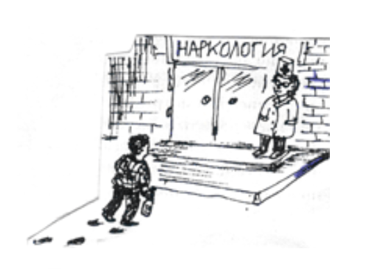
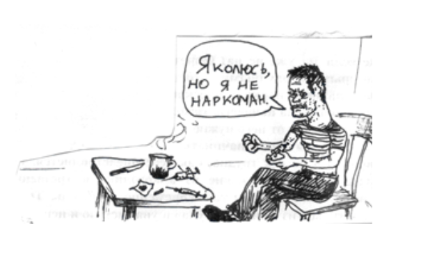
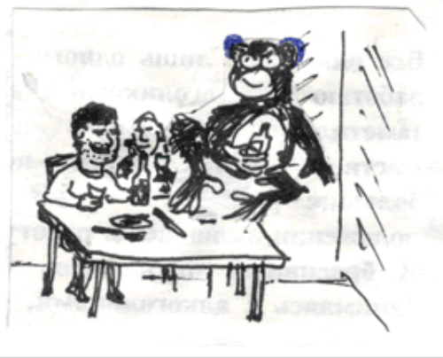
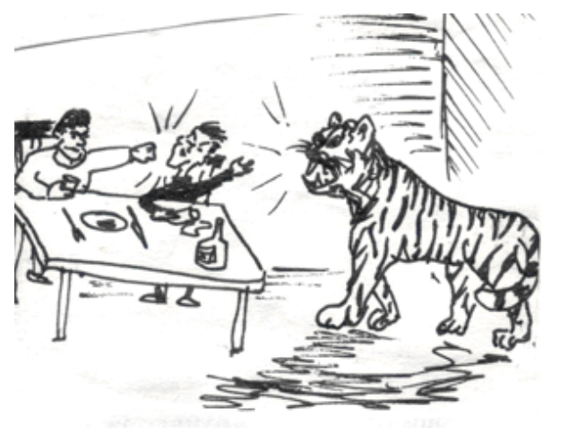
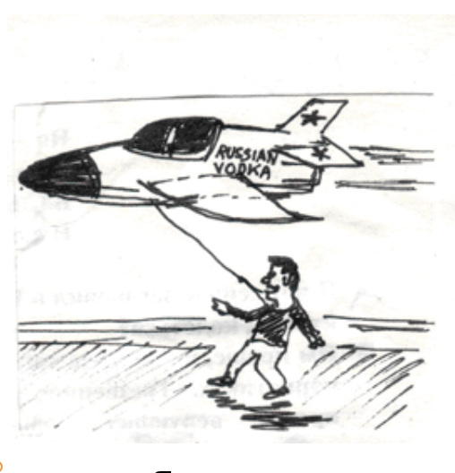
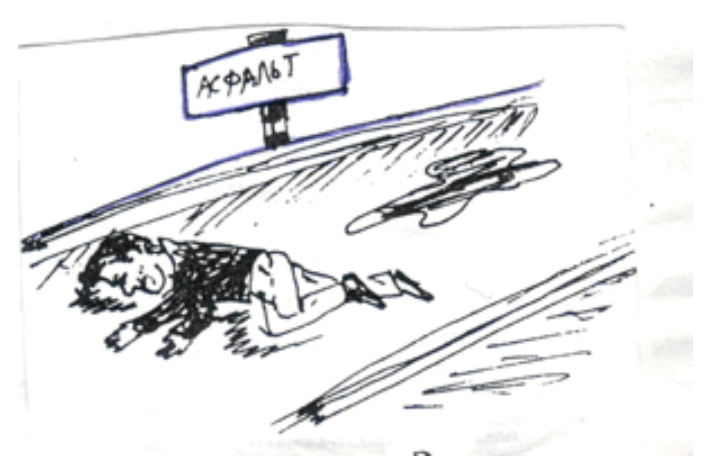
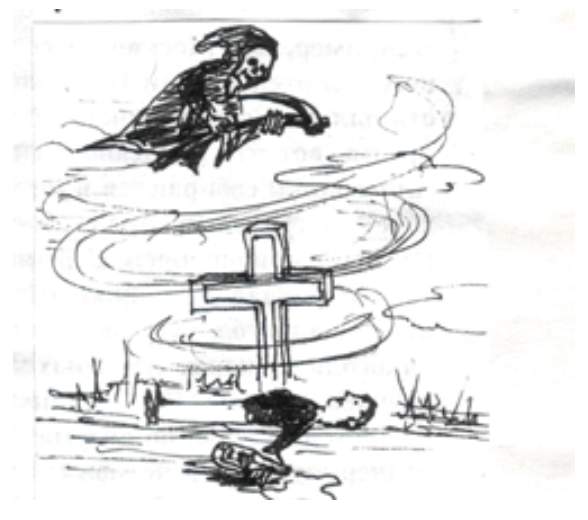
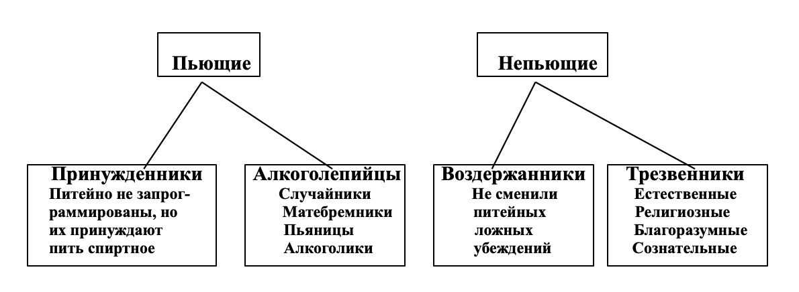
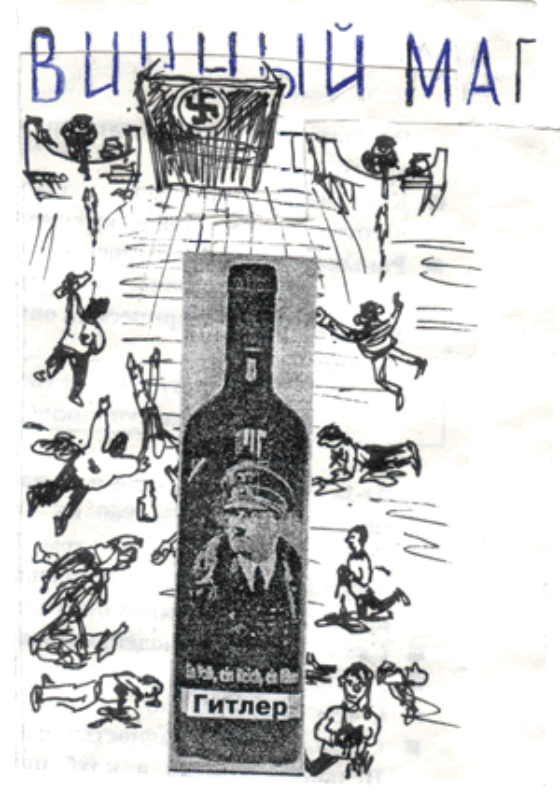
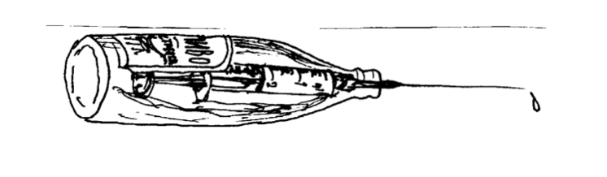

> [Геннадий Шичко](https://ru.wikipedia.org/wiki/Шичко,_Геннадий_Андреевич) о своем методе

# Как стать сознательным трезвенником

* Благотворительный фонд имени Г. А. Шичко – общественная организация, фонд не занимается  политикой, не поддерживает и не выступает против какой-либо политической партии
* Фонд помогает наркоманам и их семьям  независимо от цвета кожи, национальности, вероисповедания, финансового положения
* Фонд не является религиозной организацией, не связан с какой-либо религией, верой или сектой
* Членство в Фонде бесплатное, Фонд существует благодаря добровольным  пожертвованиям только членов фонда, мы независимы, благодаря нашим добровольным взносам

> Все права программы принадлежат Благотворительному Фонду имени Геннадия Андреевича Шичко Программу нельзя использовать с коммерческой целью для получения прибыли Никакая часть этой программы не может быть скопирована в какой-либо форме без письменного разрешения фонда

> © Благотворительный фонд им. Г. А. Шичко, 1995 Все права сохраняются за их владельцем

Адрес фонда : [РОССИЯ, 620014, г. Екатеринбург, ул. Хохрякова, № 33-3.](https://yandex.ru/maps/-/CDBfIJ7i) 
Тел/факс. [+7 (343) 267-17-17](tel:73432671717), [+7 (343) 243-91-81](tel:73432439181) 
E-mail: [trezvayarussia2016@mail.ru](mailto:trezvayarussia2016@mail.ru) 
Сайт: www.trezvayarussia.ru 
Группы VK: [@trezvayarussia96](https://vk.com/trezvayarussia96) [@trezvayarussiareports](https://vk.com/trezvayarussiareports)

### Никогда не сдавайся!

### Наркомания победима!

# Как стать сознательным трезвенником

> Светлой памяти Геннадия Шичко посвящается…

Загадочный метод Шичко – одним он приносит счастье, радость и долгую трезвость, другим – разочарование и снова уход в омут пьянства и наркомании. В чем здесь дело? Почему это происходит? Давайте спросим об этом основателя метода

`🅱` Геннадий Андреевич, в чем состоит ваш метод избавления от алкоголизма и наркомании?

`🅾` Для того, чтобы ответить на этот вопрос, надо дать определение – что такое алкоголизм и наркомания и кого можно назвать наркоманом и алкоголиком. `Алкоголизм` – психологическое страдание, основными признаками которого являются питейная запрограммированность, привычка к употреблению спиртного, потребность в нем и поглощение его

Алкоголик – питейнозапрограммированный человек, обладающий привычкой к употреблению спиртного, потребностью в нем и пьющий. `Цель метода` – избавить человека от первых трех признаков, тогда четвертый исчезнет сам по себе

`🅱` А разве не достаточно избавить человека только от потребности?

`🅾` Нет, не достаточно. Для серьезной и эффективной работы надо учитывать все четыре признака

`🅱` А что такое наркомания?

`🅾` Алкоголизм, курение, наркомания – родственные занятия, они являются наркоманиями. Поэтому то, о чем мы с тобой сейчас говорим, может быть, по аналогии перенесено на курение и наркоманию. В виду схожести понятий, я применяю термин «фармаконаркоман», в связи с тем, что понятие «наркоман» имеет большой объем и включает в себя не только морфинистов, героинистов и им подобных, но и алкоголиков и курильщиков. Привожу иллюстрацию переноса определения. `Фармаконаркоман` – пронаркотически запрограммированный человек, обладающий привычкой к употреблению фармаконаркотиков, потребностью в них и прибегающий к ним

`🅱` Вы сказали, что алкоголизм – это психологическое страдание, а разве это не психическая болезнь?

`🅾` Его располагают на границе психологии и психиатрии, поэтому рассматривают и как болезнь, и как психологическую зависимость. Наиболее же точное определение – страдание. Алкоголики и наркоманы – это страдающие люди. Психические же болезни – такие как белая горячка, алкогольное слабоумие, алкогольные психозы, алкогольный бред ревности и т. д. – имеют право лечить лишь врачи. К ним и только к ним в таких случаях надо обращаться за помощью. Доморошенные «целители», ничего кроме вреда тут не принесут

`🅱` А что такое запрограммированность?

`🅾` `Питейная запрограммированность` – это искаженность сознания человека <u>ложными</u> проалкогольными сведениями, вынуждающая его <u>вопреки инстинкту самосохранения</u> употреблять те или другие наркотики. В нее входят: *установка*, *программа*, *питейное убеждение* (*ложное убеждение*)

`🅱` Что такое установка?

`🅾` `Установка` – это решение употреблять спиртное (курить сигареты), принятое обычно неосознанно в детстве под влиянием окружающей среды

`Программа` – это процедура употребления спиртного (`что пить?`, `когда?`, `с кем?`, `сколько?`)

Программа может меняться в течение жизни. Например, человек принимает решение пить только по праздникам, потом при встрече друзей, а потом по поводу и без повода и начинает пить с пива и шампанского, а заканчивает клеем и одеколоном

`Питейное (ложное) убеждение` – твердая уверенность человека в том, что прием спиртного представляет собой естественное, полезное и даже неизбежное в жизни занятие

Под влиянием всего вышесказанного, а особенно, под действием ложных убеждений, человек начинает употреблять спиртное (сигареты, наркотики) и у него появляется привычка

`🅱` Что такое привычка?

`🅾` `Привычка` – это устойчивые действия в питейных ситуациях (например, выпивать по случаю определенных событий: праздники, встреча друга и т. д.). Воздержание от удовлетворения привычки вызывает чувство психологического дискомфорта. Далее привычка переходит в потребность

`🅱` А чем привычка отличается от потребности?

`🅾` `Потребность` – очень сильная, иногда непреодолимая тяга к спиртному (наркотикам), появляющаяся после приема первых порций алкоголя. Воздержание от удовлетворения потребности вызывает физические страдания. Давай вместе с тобой нарисуем схему того, о чем мы сейчас говорили

### Схема запрограммированности

Итак, мы нарисовали схему входа человека на скамью алкоголика

`🅱` Понятно, но как алкоголик может избавиться от потребности?

`🅾` Смотри, потребность вспыхивает после употребления первых порций алкоголя. Получается по поговорке: «Аппетит приходит во время еды». Кстати, вспышка алкогольной жажды после первых рюмок наблюдается у всех алкоголиков, здесь нет ничего удивительного. Это общая физиологическая закономерность. Мы по собственному опыту знаем, что легче переносить голод и жажду, чем в начальный период их удовлетворения остановиться. И если не будет этой первой рюмки, первых ста грамм, **<u>то не будет и потребности</u>**

`🅱` Если достаточно только прекратить употреблять спиртное, чтобы исчезла потребность, то почему этим не пользуются алкоголики?

`🅾` **Вся беда в том, что они не признают себя алкоголиками и стараются научиться «пить как все»**

`🅱` Почему?

`🅾` Потому что убеждены, что это полезно для здоровья. К сказанному выше о потребности нужно добавить следующее. Она легко и быстро угасает под влиянием разных психологических воздействий. Почти все алкоголики в этом убеждаются на собственном опыте. Иногда бывает достаточно прочесть серьезный противоалкогольный материал, чтобы влечение к спиртному пропало. Один факт, `15 декабря 1974 года` алкоголик `А. К.` решил прекратить свое ужасное существование, поскольку, как он думал, оказался в безвыходном положении: признан безнадежным алкоголиком (лечился и пил, после окончания курса пьянство усилилось), нависла угроза потери работы, семьи и жилища. Решил для храбрости выпить пива и… Сдал бутылки. В пивной ларек огромная очередь. Чтобы отвлечься от горьких дум, развернул случайно оказавшуюся в руках газету «Смена», увидел большую статью `«Двуликий Бахус»`, в которой сообщалось о наших противоалкогольных организациях – [Клубе благоразумия](vk.com/blagorazumno) и `Противоалкогольной секции штаба ДНД Петроградского района`. Прочел раз, второй… Подошла очередь, но желание пить и умереть пропало. На удивление всем пива не взял, ушел… Стал почти трезвенником. Даже на Новый год спиртного не коснулся. `6 января` впервые пришел в нашу `Противоалкогольную секцию` и в течение полутора месяцев был на правах вольнослушателя, никто им не интересовался. За все это время ни разу у него не появилось желание выпить. Под нашим влиянием из стихийного трезвенника превратился в убежденного. За неполные 4 года достиг многого: стал отличным производственником, крупным общественником, настоящим главой семьи, удостоен трудовых медалей, приобрел собственный автомобиль… Примечательно, что лечение `А. К.` не помогло, спасла от алкоголизма газетная статья. Прошу моих читателей, безуспешно лечившихся от алкоголизма не отчаиваться, продолжать борьбу за себя: немного целеустремленности, и жуткая пьяная жизнь уйдет в прошлое

> 💡 *Примечательно, что `А. К.` спасла от самоубийства  и алкоголизма газетная статья*

`🅱` Значит необходимо признать себя алкоголиком? И как определить: <u>я алкоголик или нет</u>?

`🅾` Признать себя алкоголиком – значит посмотреть правде в глаза. Определить ты это можешь, как мы уже говорили, по потребности: если после первых рюмок вспыхивает алкогольная жажда – значит налицо потребность. А наличие потребности признак алкоголизма. К тому же я привожу три стадии, познакомившись с которыми пьющий может сам поставить себе диагноз

### Стадии алкоголизма

1. **<u>Стадия 1</u>**: потребность `слабо` выражена, но по мере продолжения употребления алкоголя усиливается, алкоголик способен ее преодолеть и самостоятельно, стать `воздержанником`; переносимость алкоголя (`толерантность`) непрерывно поднимается и превосходит первоначальную дозу раза в три; отсутствует рвотная защитная реакция; утрачивается способность произвольного прерывания выпивки; похмельный синдром слабо выражен и не всегда появляется; отмечаются отрывочные воспоминания о событиях периода опьянения; пьянство носит `относительно систематический` характер
2. **<u>Стадия 2</u>**: потребность `настолько значительна`, что алкоголик неспособен справиться с нею; переносимость алкоголя достигает наибольшей дозы и далее многие годы держится примерно на этом уровне, затем намечается ее падение; рвотный рефлекс отсутствует; к утрате количественного контроля присоединяется утрата ситуационного; становится сильно выраженным похмельный синдром; провалы в памяти становятся все больше и больше; пьянство `систематическое` и `запойное`; изредка появляются психозы и припадки эпилепсии
3. **<u>Стадия 3</u>**: потребность в спиртном `ярко выражена`, она вспыхивает и становится непреодолимой после приема рюмки спиртного; переносимость алкоголя значительно снижается; восстанавливается рвотный рефлекс; полностью утрачивается количественный и ситуационный самоконтроль; похмельный синдром ярко выражен; забывание событий периода опьянения бывает постоянное, полное и происходит даже после приема небольших доз алкоголя; пьянство `систематическое` и `запойное`; часто появляются психозы и выраженные припадки эпилепсии; быстро протекают: деградация личности, резкое снижение профессиональных навыков и трудоспособности, `утрата связей с родственниками` и трудовым коллективом

Графически стадии можно изобразить так:

`🅱` Можно немножко поподробней, чем характерна первая стадия, и чем она отличается от второй?

`🅾` В первой стадии идет увеличение дозы, например, если раньше организм переносил `300 г`, то сейчас `900 г` и т. д. Во второй стадии достигнут физиологический предел дозы и далее (эта доза) держится долгие годы примерно на одном уровне и как только начинается ее снижение, <u>это говорит о начале третьей стадии</u>. На третьей стадии организм начинает снижать дозу и вначале алкоголик успокаивается, ему кажется, что самое страшное позади, он даже хвастается, что стал пить меньше. В конце концов организм, чувствуя что его убивают, начинает выбрасывать алкоголь – восстанавливается рвотный рефлекс, который был в самом начале (`вспомни`, как рвет пьющих при первых пьянках). В конце концов после очередной пьянки наступает смерть – `бессмысленная жизнь` и `бессмысленная смерть`. Стоило ли ради всего этого жить?

`🅱` Хорошо, я признал себя алкоголиком, перестал пить спиртное, у меня исчезла потребность. А как от привычки освободиться?

`🅾` Ты правильно понял, что с прекращением употребления исчезает потребность, кстати, некоторые алкоголики, сами того не зная, пользуются этим и кому-то удается сохранять трезвость многие годы, отдельным – всю жизнь, их обычно называют людьми с «железной волей». Что же касается `привычки`, то она `сама собой угасает` в случае отказа от выпивок. Ее можно подавить грамотной лекцией, умелой беседой, специальными занятиями на курсе по избавлению от алкоголизма. **Привычка – это условный рефлекс, а условный рефлекс разрушается**

`🅱` Остается запрограммированность?

`🅾` Да, особенно ее последнее звено – `питейное (ложное) убеждение`. Она сама по себе не пропадает, ее не вытравить ни лекарствами, ни физиотерапией, ни иглоукалыванием, ни даже гипнотическими внушениями отвращения к спиртному. `Выросшая на проалкогольной лжи`, она рассеивается `только под влиянием знаний`, `правды`. Я многие годы избавляю людей от алкоголизма и курения только с помощью научных знаний, без каких-либо гипнотических, экстрасенсорных и прочих воздействий. Сведения, которые я довожу до людей, содержат правду и только правду, именно это и делает их эффективным средством отрезвления людей. Хочу подчеркнуть – в информации, которую я передаю слушателям, нет никакой нелегальщины, она состоит из официальных материалов, ни один из которых не был осужден

`🅱` Значит самое главное звено в запрограммированности – `питейное (ложное) убеждение`?

`🅾` Безусловно, **это твердыня и фундамент пьянства и алкоголизма**

`🅱` А чем отличается пьяница от алкоголика?

`🅾` Посмотри снова на схему запрограммированности. У пьяницы в отличие от алкоголика нет потребности. Пьяница – питейнозапрограммированный человек, обладающий привычкой к употреблению спиртного и регулярно пьющий

`🅱` А почему одни люди становятся алкоголиками, а другие нет?

`🅾` Все люди рождаются естественными трезвенниками и остаются ими до тех пор, пока не познакомятся со спиртными напитками, или пока в их сознание не проникнет первая проалкогольная ложь. У каждого человека есть природная защита от алкоголя, у кого-то больше у кого-то меньше

> 💡 *Все люди рождаются естественными трезвенниками*

`🅱` У каких людей ее меньше?

`🅾` У матебремников (мать + бремя). `Матебремники` – люди, на которых их матери в период беременности возложили бремя собственного пьянства, у них, до появления на свет сформировался `«зародышевый алкогольный синдром»`, проще говоря, потребность в спиртном. Поскольку грудным детям алкогольные изделия не дают, она угасает, но в дальнейшем, когда несчастный станет случайником, воскреснет, и он превратится в матебремника, а с переходом к регулярным попойкам – в алкоголика. Данная группа очень быстро спивается, иногда для обретения алкоголизма им хватает несколько выпивок

`🅱` Значит, эти люди обречены быть алкоголиками?

`🅾` Биологическая защита у них слабая, но она все равно есть, и если бы им с детства рассказали правду об алкоголе, то они, не начиная употреблять спиртное вообще, так бы и остались естественными трезвенниками

`🅱` Как найти таких людей среди тех, которые обращаются к вам за помощью?

`🅾` Они могут узнать об этом от родителей, но вряд ли какая мать скажет об этом. Данный термин необходимо знать будущим матерям, они должны быть в курсе, чем грозит их пьянство при беременности и после. Ведь распространенно ошибочное мнение, что полезно пить пиво во время кормления грудью, чтобы ребенок крепче спал

`🅱` Вы сказали, что это зародышевый синдром, и виновата мать, а в каком случае будет виноват отец?

`🅾` Когда во время зачатия или он, или жена, или оба вместе будут в состоянии алкогольного опьянения

`🅱` Это называется передача алкоголизма по наследству?

`🅾` Нет, муж с женой могут редко употреблять спиртное, здесь говорится именно об этом моменте

`🅱` А как же алкоголизм передается по наследству?

`🅾` Есть только наследственная предрасположенность, но алкоголизм по наследству передаться не может, так как главное звено алкоголизма – ложные убеждения, а ложные убеждения по наследству не передаются, они формируются в течение жизни

`🅱` Вы знаете, я слышал, что есть такие приборы, которые при рождении могут определить – будет ли этот человек алкоголиком или нет. И если будет, то его предупреждают: «*Тебе пить нельзя, даже чуть-чуть, потому что у тебя отец алкоголик. Вот другим можно, а тебе нельзя*»

`🅾` Это все равно, что сказать сыну, отец у которого вор: «Тебе вообще нельзя воровать, даже чуть-чуть, иначе ты можешь стать таким же, как твой отец. Вот мне можно немножко воровать, так как у меня батя „честный“!»

`🅱` А у них больше шансов стать алкоголиками, если они родились в их семьях?

`🅾` Модели поведения могут передаваться, есть такое понятие, как наследственность и научение, но они не всегда проявляются. К тому же алкоголик с больной печенью может по наследству передать ее и ребенку. Заметь, не алкоголизм, а больную печень

В результате этого, когда человек выпьет, у него из-за плохой работы печени в кровь попадает больше алкоголя, чем у здорового. В крови есть тельца, которые убивают алкоголь – `алькогольдегидрогиназа`, а они (тельца) тоже работают слабо. В итоге один лежит на асфальте, а другому с такой же дозы хоть бы что. Но это еще раз повторяюсь, если матебремник, или ребенок которого «сделали по пьянке» или же рожденный от алкоголиков попадает в пьющую среду. Ж<u>иви он в трезвом обществе, он так бы и остался трезвым</u>

> 💡 *Заметь, не алкоголизм, а больную печень*

`🅱` Вы говорили, что в отличии от здоровых людей, у них более слабая защита. А сколько надо выпить здоровому человеку, родившемуся от здоровых родителей, чтобы `сломать` природную защиту?

`🅾` Да даже предположим, что мы с тобой доказали алкоголику, что это у него от родителей, а дальше что? Кому от этого легче? Какой он сделает вывод? Обидится на родителей? А что сделает врач? Родителей изменит?

`🅱` А кому легче достичь трезвость, им или обычным людям?

`🅾` Не имеет значения, главное, как мы уже говорили, сменить ложные убеждения. В нашей стране имеются так называемые «целители», которые в качестве универсального лечебного средства используют алкоголь. Например, один такой полуграмотный «чудотворец» за минуту по пульсу обнаруживает набор заболеваний и все их лечит разбавленным спиртовым настоем женьшеня. По его данным, на один курс расходуется 3 литра чистого спирта и 50 г этого редкого корня. В день положено выпить три стакана, то есть `600 мл` тридцати процентной спиртовой настойки. Первые порции такого снадобья у малопьющих, по утверждению очевидца вызывают тяжелые реакции: рвоту, головную боль, понос, буйство и т. д. Некоторым ослабленным людям и уже имеющим опыт поглощения алкогольных напитков достаточно этих трех литров этанола, выпитых в короткое время, чтобы приобрести алкоголизм и основательно расстроить здоровье

`🅱` Но конкретной дозы нет?

`🅾` Конкретной дозы нет, но все пьющие с приемом новой порции алкоголя вносят очередной вклад в формирование потребности. Скорость ее появления зависит от алкоголизмийности, то есть от степени подверженности человека алкоголизму, а она зависит от многого, в том числе от пола, возраста, здоровья, перенесенных заболеваний, особенностей мозга и т. п. У тебя оказалась повышенная алкоголизмийность, поэтому ты спился раньше многих собутыльников, отдельным же людям для завершения алкоголизма не хватает укороченной пьянством жизни. Известно, что всякий пьющий сокращает свою предстоящую жизнь, причем алкоголики на 10-20 лет. Если ты перенес сотрясение мозга, то спился в 5 раз, а то и в 10 раз быстрее, чем в норме, если твоя мать в период беременности пила, то алкоголизм наступил еще быстрее

> 💡 *Если ты перенес сотрясение мозга, то спился в пять раз, а то и <u>в десять раз быстрее</u>, чем в норме*

Людей, застрахованных от алкоголизма, не существует. Если бы ты реже прикладывался к бутылке и поглощал менее крепкие напитки, то, возможно, сейчас шествовал по пути `алкоголизмии`, а не алкоголизма. У каждого человека имеется своя критическая программа поглощения спиртного, превышение которой приводит к алкоголизму

> 💡 *Людей, застрахованных от алкоголизма, не существует*

Если допустим, твоя критическая норма предусматривала употребление по `350 мл` крепленого вина в праздники, то, соблюдая ее, ты мог оставаться пьяницей до наступления средней продолжительности жизни, для мужчин это примерно 64, для женщин 74 года. Если бы ты «обмывал» и личные важные события, и переключился с вина на водку, то стал бы алкоголиком. Никто из пьющих не знает свою критическую программу, к тому же она со временем изменяется. Если бы существовали методики определения этих программ, и тебя через каждые 5-10 лет с их помощью обследовали и сообщали об опасном режиме поглощения спиртного, а ты игнорировал советы и пришел к алкоголизму, то ответственность за это легла бы на тебя. На сегодня таких методик нет, поэтому вменять в вину тебе алкоголизм неправильно

`🅱` А чем пьяница отличается от алкоголика?

`🅾` Тем что у пьяницы <u>есть</u> только <u>привычка</u>, а <u>потребности нет</u>. Смотри: `ПЬЯНИЦА` – питейно запрограммированный человек, имеющий привычку к спиртному и регулярно пьющий

`🅱` Значит пьяница тоже психологически зависимый человек?

`🅾` Безусловно, он так же <u>запрограммирован</u>, имеет <u>ложные убеждения</u> и <u>привычку</u>

`🅱` А в чем отличие пьяницы от культурно пьющего человека?

`🅾` Отличия никакого нет. Это неверное словосочетание. Это все равно что «культурное хулиганство». Представь себе, что к тебе подошел человек с ножом и сказал: «Здравствуйте, я культурный хулиган, отдайте мне, пожалуйста, ваш кошелек!» Люди, которых обычно называют «культурно» или «умеренно» пьющими, в действительности являются пьяницами. Способны ли, так называемые умеренники, не выпить в праздник? В гостях? На работе во время коллективной попойки? У себя дома за пиршеским столом? Нет! Почему? Да потому, что его принуждают пить питейная запрограммированность и привычка. Спрашивается, в чем разница между ним и пьяницей? Ее нет! 

`🅱` А «культурно пьющие» признают себя пьяницами?

`🅾` Мы с тобой говорили, что алкоголик не признает себя алкоголиком, пьяница не признает себя пьяницей. Мы сталкиваемся с довольно стандартной ситуацией – «культурно» пьющая жена приводит мужа алкоголика, который себя алкоголиком не признает и считает, что у него нет проблем. В то же время жена считает, что у нее тоже их нет и не считает себя пьяницей. Жена и близкие люди алкоголика должны стать сознательными трезвенниками и показать ему пример трезвой жизни

> 💡 *Жена и близкие люди алкоголика должны стать сознательными трезвенниками и показать ему пример трезвой жизни*

`🅱` А что плохого делает пьяница? Ведь он не дебоширит, не валяется в грязи?

`🅾` Он является <u>программистом подрастающего поколения</u>. Он, как бы, своим видом говорит: «*Посмотрите люди, как я пью, пейте так же и никогда не станете алкоголиками*»

`🅱` Вы хотите сказать, что он это делает специально?

`🅾` Ни в коем случае. Он не виноват, потому что в свое время в него тоже вложили алкогольную программу. Люди не виноваты в том, что пьют спиртное, курят, употребляют наркотики, они так запрограммированы

> 💡 Ни в коем случае. Он не виноват, потому что в свое время в него тоже вложили алкогольную программу. **Люди не виноваты в том, что пьют спиртное, курят, употребляют наркотики, они так запрограммированы**

Итак, с тебя снята вина за алкоголизм, но на кого ее возложить? На питейных программистов? Да, они исковеркали твою жизнь. Но почему так поступили? Из вредительских побуждений? Такое обвинение можно выдвинуть против `сивушников`, которые выдумывают и распространяют проалкогольные нелепости, фальсифицируют факты и историю. Основная масса программистов не виновата

Проалкогольная запрограммированность принуждает человека не только пить, но добровольно программировать и приобщать к спиртному других, убежденно отстаивать, подчас недобросовестно, свои взгляды и поведение. Посмотри на собственное прошлое, и ты убедишься, что сам так поступал, что на твоей совести не один пьющий, а может быть и спившийся. Мы оказались как бы в заколдованном круге: проалкогольно запрограммированные предыдущие поколения программируют новые

<u>До нашего разговора ты не был виноват в том, что пришел к алкоголизму</u>, а теперь, если не предпримешь серьезных шагов для самоспасения, если будешь по-прежнему пьянствовать, <u>то на тебя падет вина</u>. Каждый алкоголик способен волевым усилием воздерживаться какое-то время, однако, это ненадежный путь. Хорошо помни, что `АЛКОГОЛИК` - питейно <u>запрограммированный</u> человек, обладающий <u>привычкой</u> к употреблению спиртного, <u>потребностью</u> в нем и <u>поглощающий</u> его. Как только ты прекратишь выпивать, сразу же станешь воздержанником (`ВОЗДЕРЖАННИК` – питейно <u>запрограммированный</u> человек, но <u>не пьющий</u> и самое главное <u>не сменивший</u> питейных, <u>ложных убеждений</u>), для обретения же трезвости **нужно освободиться** от потребности, привычки и проалкогольной запрограммированности

Потребность и привычка легко угасают, многим бывает достаточно настроиться на трезвость, и они перестанут беспокоить. Потребность, как мы уже говорили, появляется только после приема какого-либо количества алкоголя

`🅱` А если человек мучается с похмелья?

`🅾` Выгоднее и спокойнее для себя перетерпеть алкогольную жажду, чем пытаться частично утолить ее. Частичное утоление допустимо только при наличии тяжелого абстинентного страдания, появления непереносимых мук. Нужно небольшую порцию спиртного, например, полстакана вина разбавить 3-5 частями воды, пить медленно и с возможно большими перерывами, при этом сосредоточенно думать о том, что потребность пропадает, самочувствие улучшается. Еще лучше – хорошо поесть, невзирая на отсутствие аппетита. Подобные ухищрения потребуются очень немногим читателям. Вдумчивое чтение нашего разговора, правильное понимание и хорошее усвоение его способны угасить привычку к употреблению спиртного и потребность в нем. Кроме того, у тебя поднимется настроение, `появится радость` в связи с приобретением научных, к тому же жизненно важных знаний, ты почувствуешь себя освобождающимся от омерзительных и страшных объятий «зеленого змия». Настройся на пожизненную трезвость, глубоко размышляй над алкогольной проблемой, подвергни критике свои проалкогольные взгляды и представления, усваивай научные знания – все это будет содействовать освобождению от питейной запрограммированности и обретению трезвости

**Трезвость в наши дни – ценнейшее личностное свойство человека**, ею следует **гордиться**, как горжусь я и многие бывшие алкоголики, получившие от меня помощь. Не удается самостоятельно освободиться от алкоголизма, не прекращай борьбу за себя и за свою семью, обратись к наркологам, даже если ты уже не раз безрезультатно лечился. Теперь ты вооружен некоторыми научными трезвенными знаниями, они повысят эффективность наркологической помощи. Твердо помни: алкоголизм – это большая беда пьющего, тяжелое горе его семьи, печаль общества. Как от всякой беды, от него нужно стараться <u>скорее освободиться</u>

`🅱` В какое время лучше начинать?

`🅾` Поверь, это не так трудно, как тебе представляется. Не откладывай на завтра свое преображение из алкоголика в трезвенника, сегодня же начинай действовать и ты непременно победишь. Ты можешь и обязан превратиться из «живого трупа» в уважаемую и ценную личность

`🅱` Геннадий Андреевич, а почему алкоголизм считается неизлечимой болезнью? Многие говорят так, в том числе врачи с мировыми именами

`🅾` Смотри, все дело в том, что они пользуются другим определением что такое алкоголизм. Для них алкоголизм, это только наличие потребности и алкогольной жажды

`🅱` Но ведь вы тоже говорили, что алкоголик отличается от пьяницы только наличием потребности

`🅾` Да, это так, но именно из этого делают неправильный вывод, что алкоголизм это только потребность. А разве у алкоголика привычки нет? А разве он не запрограммирован? Вот почему, когда ты спросил меня в самом начале разговора, я дал определение, что такое алкоголизм и кого можно назвать алкоголиком

> 💡 *А разве у алкоголика привычки нет?*

`🅱` Но ведь врачи тоже подавляют потребность, почему же они все-таки считают это неизлечимой болезнью, если все дело только в этой потребности

`🅾` Все дело в том, что алкоголик не может научиться <u>пить «культурно»</u>, по «чуть-чуть» и это на самом деле невозможно, <u>невозможно никогда и никому</u>. Но из этого делают неправильный вывод – если не можешь научиться пить культурно, значит ты неизлечимо больной

`🅱` Но ведь это же на самом деле так

`🅾` Понимаешь, мы допились до того, что трезвого человека в нашем обществе считают больным. И только культурно пьющего считают здоровым. А почему я должен ставить себе цель – научиться пить культурно? Я себе ставлю цель – полное исключение алкоголя и наркотиков из своей жизни

Ведь если мы перенесем эти понятия на наркоманию, то получится страшная вещь – наркоман, который колется по чуть-чуть считается здоровым, а который уже на системе, которого уже кумарит, если он не уколется – больной

> 💡 *А почему я должен ставить себе цель – научиться пить культурно?*

> 💡 *Получится страшная вещь – наркоман, который колется по чуть-чуть считается здоровым*

`🅱` Да, это конечно смешно. Выходит, что культурно пьющий – это наркоман, который колется по чуть-чуть?

`🅾` Абсолютно верно! Ведь культурно пьющий, а иными словами это просто пьяница, психологически зависимый человек, он не может обойтись в праздник, на дне рождении, юбилее и т. д. без спиртного

> 💡 ***Выходит, что культурно пьющий – это наркоман, который колется по чуть-чуть?***

`🅱` Вы знаете, Геннадий Андреевич, я сейчас вспомнил, как мне одна моя знакомая рассказывала, что на Новый Год они не смогли достать шампанского, так она потом от этого целый год страдала! Даже купила две бутылки и спрятала их до Нового Года!

`🅾` Да, это так, здесь работает алкогольная программа праздника. Алкогольная программа праздника – начало всех пороков!

> 💡 ***Алкогольная программа праздника – начало всех пороков!***

`🅱` Как нам относиться к культурно пьющему человеку?

`🅾` К человеку вообще, к любому человеку надо относиться с уважением, в том числе к алкоголикам и культурно пьющим. Нам надо всегда помнить, что люди не виноваты в том, что они пьют, они так запрограммированы

> 💡 ***Люди не виноваты в том, что они пьют, они так запрограммированы***

`🅱` А к алкоголикам? Ведь считается, что это довольно ненадежные люди

`🅾` Мне иногда говорят: на кого ты надеешься? На алкоголиков! Да они пропили весь свой ум. У них нет воли, ослаблена память. Все они хотят лишь одного: выпить! Но это неверно! Я многие годы работаю с алкоголиками. Да, многие качества они растеряли. Но я заметил: даже и самый запойный пьяница сохраняет способность к умственной деятельности, подчас к очень серьезной. Наш мозг имеет большие резервы. Ученые утверждают: человек и в нормальном положении включает в работу лишь небольшую часть мозговых клеток. И бросивший пить вновь ясно мыслит и многого может достичь. Занимаясь с алкоголиками, я наблюдал их в те счастливые для них минуты, когда в их сознании выстраивается стройная система антиалкогольных понятий, когда они решают для себя – не пить! На их лицах тогда я вижу мощный прилив жизненных сил, их глаза светятся радостью – они в такие минуты испытывают желание писать стихи. Вот почему я верю и во второй метод отрезвления – то есть путем самостоятельного чтения

За работу по избавлению от алкоголизма и курения, проводимую мною в личное время, не только <u>не беру платы</u>, но решительно отвергаю подарки и даже цветы. На первом занятии как с алкоголиками, так и с курильщиками особо подчеркиваю, что не следует терять время на поиск достойного вознаграждения моего труда, что всякую помощь нуждающимся я оказываю бескорыстно и безвозмездно; если кому-то захочется вызвать у меня негативное отношение к себе, может попытаться «отблагодарить» меня, награду я не возьму, но на его образе в моей памяти появится черное пятно. На деньги алкоголики и их родственники бывали щедры, некоторые пытались тайно от меня вручить деньги жене. Например, одна мать оставила 500 рублей, потом моей жене пришлось разыскивать ее, чтобы возвратить эту сумму. Частенько же алкоголики и их близкие весьма скупы, они, как правило, не выполняют мои элементарные просьбы: вести дневник, периодически информировать меня и своевременно возвращать мои материалы

> 💡 *Вот почему я верю и во второй метод отрезвления – то есть путем самостоятельного чтения*

`🅱` Скажите, а чем еще пьяница отличается от алкоголика?

`🅾` Пьяница в отличии от алкоголика не доводит себя до `4 степени` опьянения

`🅱` А что это за степени? Можно поподробней?

`🅾` Для успешного проведения отрезвляющей работы наиболее подходящей является классификация, исходящая не из концентрации алкоголя в крови, а из `степени отравленности мозга`. Выделено шесть степеней: <u>дурашливость</u>, <u>буйность</u>, <u>параличность</u>, <u>безумность</u>, <u>усыпленность</u> и <u>наркозность</u>

`🅱` Расскажите о первой степени

`🅾` `Первая степень` (*дурашливость*) – это слабое опьянение, появляется после приема малой дозы этанола, характеризуется ненормальным возбеждением, в связи с которым появляются: повышенная подвижность, болтливость, развязность, бахвальство, шумливость, самонадеянность

`🅱` Понятно, это еще я помню, называется обезьяна, а вторая видимо будет тигр?

`🅾` Да, это *буйность*, опьянение, при котором достигается наибольшая патологическая возбужденность мозга, которая обуславливает повышенную раздражительность, вспыльчивость, озлобленность, склонность к скандалам и дракам. Буйность не всегда проявляется в таком виде. Если пьяного никто и ничто не тревожит, он может спокойно вести себя. Например, муж пришел домой в этой степени, а его стала ругать жена. Лучше всего эти «разборки» делать с утра

`🅱` Ну и последняя, которую я знаю, это свинья, только не понимаю, почему их шесть?

`🅾` «Свинья», как ты говоришь, расписана еще на четыре стадии. Итак, `степень опьянения № 3.` (*параличность*) – степень опьянения, при которой токсическое возбуждение сменяется токсическим все усиливающимся торможением мозга. Характерными признаками третьей степени опьянения является усиливающееся нарушение координации двигательных актов: речи, хотьбы, работы рук. В крайнем случае, паралично пьяный не может самостоятельно передвигаться. Во всех первых трех степенях опьянения пьяный помнит, что с ним происходит

`🅱` Значит четвертая степень, когда он не помнит, что с ним происходит?

`🅾` Да, это *безумность* – такая отравленность мозга этанолом, при котором имеет место как бы `функциональный распад мозга`. Утрачена тонкая согласованная мозговая деятельность, сознание подавлено, поэтому безумно пьяный не соображает, что делает и говорит, он порой бормочет всевозможные нелепости. Способность думать нарушена, в крайнем случае, полностью утрачивается. Признаки безумности наблюдаются при первых трех степенях опьянения, однако, она ярко выражается лишь при четвертой

`🅱` Это мне знакомо, у нас это еще называется `«автопилот»`. Я иногда в этом состоянии очень долго ходил и очень часто просыпался дома, не помня, как я там оказался. А пятая?

`🅾` Пятая степень (`усыпленность`) – алкогольный  сон.  Пьяный не утрачивает чувствительность, поэтому его можно тем или иным способом разбудить и даже заставить встать на ноги

`🅱` Понятно, это значит, пьяный ходил, ходил, упал и уснул. Это еще называется «*асфальтовая болезнь*», помню, я часто просыпался на снегу от холода, а ведь мог замерзнуть и не проснуться. Я сейчас вспоминаю об этом, и мне становится страшно

`🅾` Ты просыпался, потому что не доходил до последней степени опьянения (`наркозность`) – алкогольный наркоз. Пьяный полностью утрачивает чувствительность и защитные рефлексы, поэтому может утонуть в ванне и в луже, захлебнуться рвотной массой, сгореть в огне, вызванном выпавшей изо рта сигаретой. Наркотическая широта этанола мала, то есть мало отличаются дозы приводящие к наркозу и к смерти, поэтому в части случаев **наркоз переходит в смерть**

`🅱` Вы знаете я эту степень назову «вечный кайф», как говорится добился чего хотел. Видимо Бог уберег меня от этого, хотя в то время я неверующий был, как бы отрекшимся от Бога

Мне на память пришло из великих:

    И теперь, возвращенною мерою,
    Надчерпнувши воды живой, –
    Бог Вселенной! Я снова верую!
    И с отрекшимся был Ты со мной…

Я вот сейчас заговорил о Боге, скажите, а верующим легче бросить пить, курить, колоться?

`🅾` Им проще, но не из-за того, что они располагают знаниями об алкоголе и наркотиках. Трезвенное религиозное программирование производится просто: верующего, обычно в детстве, убеждают в греховности употребления спиртного, в неотвратимости сурового наказания Богом за нарушение запрета. В Каире `26 октября 1974 года` гид Омайма говорила мне: «Мы считаем, что, если человек пьет алкогольные напитки или спирт, он не настоящий мусульманин, поэтому попадает в ад, а не в рай. Конечно, каждый человек старается попасть в рай после смерти, а не в ад, поэтому мы и не пьем спиртные напитки». Примечательно, что египтянка училась в СССР, однако хорошо сохранила религиозную трезвенную запрограммированность. Таких людей мы называем `РЕЛИГИОЗНЫМИ ТРЕЗВЕННИКАМИ`

`🅱` Но вы говорили о мусульманах, которым и Коран запрещает алкоголь, а как же христиане?

`🅾` Здесь так же просто. В дореволюционное время в нашей стране было много обществ трезвости, которые избавляли на определенный срок алкоголиков от пьянства. Подобную работу проводили и священники. Например, под Москвой в селе Нахабино десяткам тысяч алкоголиков помогал отец Сергий Пермский. 25 сентября 1891 года он торжественно открыл при своей церкви `ОБЩЕСТВО ТРЕЗВОСТИ`. Процедура «исцеления» проста, вот что написано в книге И. С. Орлова «В Нахабино! (`М., 1899`). Алкоголики собираются в церкви, входит священник и объявляет: «Кто хочет вступить в число членов нашего общества трезвости, пусть подойдет к иконе преподобного Сергия». Толпа подходит, Пермский осматривает ее и удаляет пьяных, после чего произносит краткую противоалкогольную речь, говорит о значении обета воздержания от алкоголя, о карах небесных за нарушение клятвы. Привел несколько случаев, когда Бог покарал клятвонарушителей. Он призывал слушателей серьезно подумать, смогут ли они исполнить обет, при этом подчеркнул: «Кто не может исполнить клятвы, не чувствует для этого силы, - вернись обратно, пока можно». Затем священник преклонил голову перед иконой Сергия Радонежского, сделал молитвенную паузу и торжественно произнес: «Бог поможет и укрепит вас!» - и с этими словами осенил всех крестным знамением. Наступила мертвая тишина, Сергей произнес: «<u>Повторяйте за мною: обещаюсь перед Господом Богом и иконою преподобного Сергия в том, что в продолжении избранного мною срока не буду пить вина и других спиртных напитков, и на том целую икону преподобного Сергия</u>». Алкоголики целовали икону и произносили клятву, а священник, благословляя их, поздравлял с добрым делом, а затем отслужил молебен и торжественно произнес: «Преподобный отче наш Сергий моли Бога за нас», при этом все молящиеся встали на колени. Люди отправились к домику священника, где его хозяин записывал имена новых членов в специальную книгу, выдавал устав общества трезвости, членский билет, образок Сергия Радонежского и брошюры о вреде пьянства

`🅱` И они бросили пить?

`🅾` Конечно! По данным отца Сергия Пермского `¾` вступивших в члены общества воздерживались от спиртного. Я специально так подробно осветил процедуру религиозного отрезвления алкоголиков, чтобы показать, как просто и быстро удавалось верующим расставаться с пьянством

`🅱` Какие методы используют верующие?

`🅾` Ну, например, молятся иконе Богородицы «Неупиваемая Чаша», а так же мученику Вонифатию. Еще есть община христиан, это последователи братца Иоанна Чурикова

`🅱` Что это за община?

`🅾` Они, кроме основных моральных заповедей проповедуют еще три: не пить! Не курить! Не блудить! Я отлично знал некоторых чуриковцев, кое-где до сих пор действует это братство, они проводят помимо прочего трезвенную работу. Мне как-то довелось быть на одном из заседаний, где они рассказывали о том, как пришли к трезвости и благодарили за это дорогого братца. Один кузнец уверял, что ему лечение от алкоголизма не помогло, был помещен на неопределенное время в психиатрическую больницу, долго пролежал, чуриковцы помогли выписаться и сделали трезвенником. Активисты в выступлениях подчеркивали, что только Бог и дорогой братец, но отнюдь не врачи, способны спасти алкоголиков. Я воспользовался предоставленным мне словом, чтобы мягко опровергнуть это мнение, привел убедительные доказательства. Братец Иоанн оставил приговор Разума пьянству, я его сейчас зачитаю

### Обвинительный приговор разума пьянству

> 📜 *Я обвиняю алкоголь в том, что он лжец и обманщик, который расслабляет человека. Обещая согреть – он морозит, называясь живительным – причиняет лишь болезнь и убивает жизнь. Я обвиняю алкоголь в том, что он гнусный злодей и разбойник, грабящий у рабочего люда заработанные трудом и потом деньги, и гонит в больницы и тюрьмы. Я обвиняю алкоголь в том, что он преступник, совершающий насилия и убийства. Я обвиняю алкоголь в том, что он вероломный изменщик, который сгубил материально и нравственно миллионы людей и целые нации и государства. Я спрашиваю: кто мерзок Богу и противен людям? Пьяница. Кто беден? Пьяница. У кого жена и дети несчастны? У пьяницы. У кого с языка, как из грязного источника, всякая грязь и сквернословие льются? У пьяницы. Я утверждаю со всей решительностью — пьянство отчуждает людей от Бога и от храма Божия. Пьянство делает отцов и детей врагами друг другу. Пьянство разлучает жен и мужей. Пьянство по судам водит, в тюрьмы и на каторгу в кандалах гонит. В тюрьме, больнице, сумасшедшем доме пьяница – свой человек. Трезвый и благочестивый человек служит Богу, а пьяница – дьяволу. От вина вся беда! В вине человек губит веру и разум, стыд и совесть, силу и здоровье, свое благополучие и свое спасение. Юноши и дети! Запомните навсегда: погибель начинается от первой выпитой рюмки. Запомните: проклят всякий человек, соблазняющий чистую молодую душу на пьянство*

> 💡 <u>Запомните навсегда</u>: погибель начинается от первой выпитой рюмки

> 💡 <u>Запомните</u>: проклят всякий человек, соблазняющий чистую молодую душу на пьянство

`🅱` Братец Иоанн призывает к полному исключению спиртного, не противоречит ли это христианским традициям?

`🅾` Нет, не противоречит, трезвость всегда была одной из христианских добродетелей. Сейчас я зачитаю отрывок из книги `«Грех и безумие пьянства» 1903 г.`, и ты убедишься, что и христиане выступают за полную трезвость. Написано это в 1903 году, но и сейчас не потеряло своей актуальности

Христиане, видя, что пьянство уносит жизни людей, предупреждают:

### Обращение к верующим

> 📌 Нельзя проповедовать Христа с сигаретой во рту и с бокалом вина в руке — Иеромонах Серафим Роуз

> 📜 *Христианин, рядом с тобой умирают, гибнут люди, но «ты говоришь, что не грех выпить в меру, не грех угостить вином, водкой и пивом людей». А думал ли ты о том, с чего началась погибель тех людей, которые спились с круга и погубили и себя и свои семьи? А только оттого, что люди, старше их, при них пили и их угощали. Евангельское слово говорит: «<u>Горе миру от соблазнов, ибо надобно прийти соблазнам; но горе тому человеку, чрез которого соблазн приходит</u>». (*`Матф. 18:7`*) Молодой человек, который не пил прежде ничего пьяного, видит, что и в праздник, и в гостях, и на свадьбах, везде старшие пьют, упрашивают других пить и смеются над теми, кто не пьет. И вот молодой человек, думая, что старшие лучше его знают, что хорошо и что плохо, выпивает одну рюмку, другую, делается пьяным, а потом привыкает к пьянству и делается пьяницей. А кто соблазнил его? Через кого же, как не через ТЕБЯ, и тебя и всякого из нас, который пьет и угощает других людей. А ты знаешь это, и поэтому великий ответ тебе будет перед Богом. Слово Божие обличит тебя. Апостол говорит: «Л<u>учше не есть мяса, не пить вина и не делать ничего такого, от чего брат твой претыкается, или соблазняется, или изнемогает</u>». (*`Рим. 14:21`*) А отчего твой брат претыкается, или соблазняется? Или изнемогает? Претыкается он, глядя на твой пример, глядя на тебя, что ты сидишь за вином, пьешь, смеешься и куражишься, как будто самое хорошее дело делаешь Соблазняется он тем, что ты при каждом важном деле: при свадьбе, при крестинах, при празднике, при именинах считаешь нужным и приличным ставить вино, сам еще угощаешь его и доводишь до пьянства других людей. Отговорок нет. Ясное дело: есть две дороги, выбирай любую: одна служит врагу, другая – Богу. Хочешь служить врагу – пей сам вино, угощай людей, справляй крестины, свадьбы, похороны с угощением. И заслужишь врагу. Хочешь служить Богу, то первое – брось САМ пить вино, водку, ни много ни мало, а <u>совсем</u> брось, для того, чтобы не подавать соблазна людям, и второе: брось обычай угощать других на проводах, свадьбах, крестинах, не бойся того, что тебя осудят за это люди Бойся не людей, а Бога. Дело это не шутка. И если мы не на словах только христиане, а хотим и на деле услужить Христу и Богу, то нельзя по-прежнему пить вино и угощать им. Давайте же сделаем так и помоги нам Бог!* `Текст обращения взят из книги «Грех и безумие пьянства» 1903 г. • От Петербургского Духовно-цензурного комитета печатать дозволяется • Цензор Иеромонах Филарет`

> 💡 *А отчего твой брат претыкается, или соблазняется? Или изнемогает? Претыкается он, глядя на **твой** пример*

> 💡 *Хочешь служить Богу, то первое º брось САМ пить вино, водку, ни много ни мало, а совсем брось, для того, чтобы не подавать соблазна людям*

`🅱` Скажите, а если верующие освоят ваш метод, что будет?

`🅾` Если же использовать еще и научные методы, то эффект окажется более значимым. Два таких метода я рекомендую, один из них – создание клуба взаимопомощи, второй – самостоятельная работа над программой по избавлению от наркомании, курения, алкоголизма

> 💡 *Два таких метода я рекомендую, один из них – создание клуба взаимопомощи, второй – самостоятельная работа над программой по избавлению от наркомании, курения, алкоголизма*

`🅱` Но ведь это же очень трудно самому…

`🅾` Да, конечно: второй метод труден, не каждому он по зубам. Это вроде самоучителя, когда, человек решил научиться играть на баяне, но не имеет возможности посещать музыкальную школу, нанять учителя-баяниста. Он покупает книгу – «Самоучитель игры на баяне», и сам, без посторонней помощи постигает искусство игры на баяне. И если человек упорен, въедлив, если он не щадит своих сил – он добьется таких высот мастерства, каких не достигнет и тот, кто учится в академии. Я встречал немало таких музыкантов. Моя квартира окнами выходит на парк имени Челюскинцев, или, как его еще называют, Удельный парк. Весной, летом и осенью здесь происходят народные игры, гуляния, танцы и коллективное пение. Тут и там звучат гармони, баяны, аккордеоны. Музыканты, как правило, нигде не учились, но как же виртуозно и красиво играют иные из них! А сколько тут самодеятельных и великолепных певцов, какие голоса! Никакой театр не дает нам столько наслаждения, сколько мы получаем у себя в Удельном парке! Но если люди самостоятельно добиваются такого мастерства в игре на инструментах, в танцах, пении, то почему же так же, в порядке самостоятельного чтения, не постигнуть сравнительно небольшую сумму антиалкогольных знаний и понятий, которая предлагается в нескольких печатных или рукописных материалах? Для этого нужно одно: <u>собраться</u>, <u>сосредоточиться</u>, и со вниманием <u>прочесть</u> эти материалы

`🅱` Вы сказали, что есть религиозные трезвенники, а какие еще есть трезвенники?

`🅾` Трезвенники в зависимости от трезвенной запрограммированности и обладания научными противоалкогольными знаниями делятся на четыре подгруппы: <u>естественных</u>, <u>религиозных</u>, <u>благоразумных</u> и <u>сознательных</u> трезвенников

`🅱` Кто такие `ЕСТЕСТВЕННЫЕ ТРЕЗВЕННИКИ`?

`🅾` Все люди **рождаются естественными трезвенниками** и остаются ими до тех пор, пока не приобретут ложные сведения об алкогольной проблеме или пока не познакомятся со спиртными изделиями

`🅱` А сознательные трезвенники?

`🅾` `СОЗНАТЕЛЬНЫЕ ТРЕЗВЕННИКИ` – люди, осмысленно, на основе <u>достаточного</u> запаса научных знаний избравшие жизнь без спиртного. Сознательные трезвенники – особо ценная часть населения, их нельзя соблазнить спиртным, они принципиальны, добровольно пропагандируют трезвость, благожелательно, сочувственно относятся к пьющим, алкоголиков считают не отбросами общества, а жертвами пьющих и в меру возможностей стараются помогать им. Алкоголик должен стремиться стать сознательным трезвенником, ибо только в этом случае он будет <u>полностью гарантирован от рецидива</u>

> 💡 *Алкоголик должен стремиться стать сознательным трезвенником, ибо только в этом случае он будет **полностью гарантирован от рецидива***

`🅱` Вы, как я понимаю, сознательный трезвенник Геннадий Андреевич. Ну хорошо, а кто такой благоразумный трезвенник?

`🅾` `БЛАГОРАЗУМНЫЕ ТРЕЗВЕННИКИ` также трезвенно запрограммированы на основе научных представлений. Программирование производится с помощью небольшого объема достоверных знаний и, в части случаев, клятвы или обета никогда не пить. Генерал армии `А. В. Горбатов`, будучи подростком, подвергся элементарному трезвенному программированию: знакомый студент после нескольких случайных противоалкогольных фраз, брошенных в разные дни, попросил Саньку дать твердое слово, что никогда не начнет пить спиртное, курить и ругаться. Подросток искренне сказал: «Клянусь, что никогда, никогда не буду пить, не буду ругаться и курить!» Генерал армии писал в мемуарах: «Сколько встречалось людей, насмехавшихся над моим воздержанием от водки и табака! Называли меня и больным и старообрядцем – насмешки не действовали. Встречалось и начальство, которое приказывало пить, но я и тут оставался твердым. Больше того, сколько ни было тяжелых переживаний в моей жизни -– никогда не приходило желание забыться в водке». (Генерал в предвоенное время был незаконно арестован, перенес пытки и издевательства, но не признал себя виновным и не состряпал ни единого лживого доноса. А. В. Горбатов проявил высокую стойкость и большую порядочность отчасти и потому, что был трезвенником и некурильщиком)

`🅱` А в чем разница между благоразумным и сознательным трезвенником?

`🅾` Разница состоит в том, что первые запрограммированы и имеют сравнительно небольшой запас научных знаний об алкогольной проблеме, а сознательные трезвенники имеют большой запас научных знаний и сменили питейные (ложные) убеждения

`🅱` А есть ли люди, которые не пьют, но не сменили питейных убеждений?

`🅾` Есть, это `ВОЗДЕРЖАННИК` – питейно-запрограммированный человек, но непьющий. Им может быть и пьяница и алкоголик, но в основном это алкоголики. Эти люди не пьют из-за страха перед чем-нибудь: жена пригрозила разводом, уволят с работы, эспераль как у Высоцкого  и т. д. Данная категория – плохой пример трезвости, проходит немного времени, и они снова уходят в запой. Давай с тобой нарисуем таблицу, чтобы было понятно, итак люди делятся на пьющих и непьющих

`🅱` Кто такие случайники?

`🅾` Случайно пьющие (`СЛУЧАЙНИКИ`) – питейно запрограммированные люди нерегулярно и обычно понемногу употребляющие спиртные изделия. К ним относятся, например, молодые люди, не имеющие собственного дохода, поэтому довольствующиеся эпизодическими подношениями. Пьянство и алкоголизм развиваются из случайного потребления спиртного

`🅱` Понятно, о матебремниках, пьяницах и алкоголиках мы говорили, остается `ПРИНУЖДЕННИК`

`🅾` Принужденников сравнительно мало, они не имеют питейной запрограммированности и сами никогда не ищут спиртное, но их принуждают пить окружающие люди. Например, тот же мусульманин, приехав в Россию и попав на свадьбу, вынужден поднять рюмку и пригубить немного, чтобы не обидеть молодоженов

`🅱` Значит, самое главное надо говорить человеку о вреде пьянства?

`🅾` Нет! Ни разговоры о вреде пьянства вообще, а <u>лишь возникновение трезвых убеждений</u> дает надежду на трезвость, человек из пьяницы становится борцом за трезвость

> 💡 *Нет! Ни разговоры о вреде пьянства вообще, а лишь возникновение трезвых убеждений дает надежду на трезвость, человек из пьяницы становится борцом за трезвость*

`🅱` Какое самое главное оружие вы используете, чтобы человек из алкоголика превратился в сознательного трезвенника?

`🅾` Это правда! Я говорю только правду. А она по сути своей проста. Вот и кажется человеку: как же я сам не додумался до этого? В Риге на конференции клубов трезвости одна женщина, которая конспектировала мою лекцию, сказала: «Вы произносите мои мысли»

`🅱` Но ведь правдивых слов они и раньше слышали немало. Вряд ли сами по себе правдивые слова смогут произвести переворот в сознании алкоголика или наркомана

`🅾` Я сам спрашивал об этом людей, которым я помогал; все они утверждают, что коренной перелом в их сознании произошел, когда они перед сном каждый день писали дневник

> 💡 *Я сам спрашивал об этом людей, которым я помогал; все они утверждают, что коренной перелом в их сознании произошел, когда они перед сном каждый день писали дневник*

`🅱` Почему именно перед сном?

`🅾` Потому что защита мозга перед сном очень слабая, мы буквально выгравировываем эти слова у себя в сознании. Поэт пишет стихи, прозаик – рассказы, повести, романы. Создавая свои произведения, они не только влияют на образ мышления читателей, на их чувства, эмоции, убеждения, но и закрепляют свои собственные понятия, формируют себя как личность. То же будет происходить и с вами в процессе написания дневников. Дневник – ваша исповедь, а исповедь очищает от всего дурного и укрепляет в вере

> 💡*Дневник – ваша исповедь, а исповедь очищает от всего дурного и укрепляет в вере*

В данном случае вам нужна вера в себя, в свою волю, в свою способность покончить с пьянством и стать трезвым человеком. Пишите дневник с охотой, с удовольствием предавайтесь этому своему творчеству. И не думайте, что вы писать не умеете, что вам никогда не удавалось писать сочинения, – в данном случае пишите произвольно и как бы для себя, легко и свободно повествуя обо всем, что связано с вашим пьянством. Ваш мозг, ваша мысль поведет вас верной дорогой, и первые же исписанные страницы явятся очистительным ветром, выдувающим из вашего организма пьяную одурь. Процесс писания дневника явится процессом очищения и выправления вашего сознания. Все плохое люди совершают в результате искаженности их сознания. Они пьют, курят, принимают наркотики, создают себе кумиров, хулиганят, воруют и т. д. потому, что у них изуродовано соответственным образом сознание. Не было, нет и никогда не появятся лекарства-нормализаторы поведения, да они и не нужны, поскольку существует простой и эффективный способ оказания помощи «заблудшему» – очищение его сознания от ложных представлений и прояснение правильными

> 💡 *Не было, нет и никогда не появятся лекарства-нормализаторы поведения*

`🅱` Геннадий Андреевич, вы выступаете за полную трезвость, но ведь если все люди перестанут пить, за счет чего же будет пополняться наш бюджет?

`🅾` Торговля спиртным никогда не приносила дохода. Например, по данным комиссии Госплана СССР, которую возглавлял А. Майкин в 1927-1928 гг., общий размер потерь народного хозяйства из-за торговли спиртным составил за год `1 170 млн. руб`, а общий доход государства `1 000 млн. руб`. К тому же **доход государству дают люди**, а из-за алкоголизма людей рождается все меньше и меньше

`🅱` Но нам всегда говорили, что государству выгодно торговать спиртным

`🅾` Государство – это мы с вами, – это наши семьи. Скажи, **какой семье выгодно пьянство хотя бы одного его члена**?

`🅱` Какой же тогда выход? Может быть это «сухой закон»? Как вы к нему относитесь?

`🅾` Я отношусь к нему положительно. Наиболее же подходящий метод – избавление людей от проалкогольной (наркотической) запрограммированности, оказание им помощи в освоении научных знаний с тем, чтобы они стали сознательными трезвенниками. С обретением массовой трезвости не замедлит появиться и запретительная система

`🅱` Скажите, с чего мне надо начать?

`🅾` **Начни с себя**! Покажи пример личной трезвости

`🅱` А вы сами раньше пили Геннадий Андреевич? И как вы стали сознательным трезвенником?

`🅾` Да, я раньше употреблял спиртные изделия: на фронте не отказывался от «сталинских ста граммов», в госпиталях в части случаев принимал «лечебные пятьдесят граммов», за пиршеским столом пил больше

`🅱` Почему же вы перестали пить?

`🅾` Ты знаешь, как-то после войны я зашел в винный магазин, там было очень много народа, очередь была к двум кассам, а я стоял и думал, что это не кассы, а немецкие дзоты, а вместо кассирш немецкие пулеметчики, и люди идут и гибнут на их амбразурах. В 1970 году, а мне тогда уже было 48 лет, я начал серьезно изучать алкогольную проблему и в то же время оказал психологическую помощь алкоголикам. По мере приобретения **достоверных** знаний, накопления собственных наблюдений над своими пациентами все усиливалось негативное отношение к спиртным изделиям, даже вкус их становился все отвратительнее. Как только я освободился от питейной запрограммированности, перестал употреблять спиртное, а с превращением в сознательного трезвенника появилось негативное отношение к этому занятию, которое стал считать **противоестественным**, ничем неоправданным и многопланово вредным

Я не только не страдаю в связи с переходом к трезвости, но и горжусь этим, чувствую себя физически и морально значительно лучше, чем прежде. Более того, много лет не могу решиться на себе провести физиологические опыты с приемом алкоголя; неприятно даже думать об этом, кажется, если выпью, то оскверню себя, измажу чем-то особо грязным

> 💡 *Кажется, если выпью, то оскверню себя, измажу чем-то особо грязным*

`🅱` Выходит, что люди, которые помогают алкоголикам и наркоманам, должны тоже не пить?

`🅾` Безусловно! Эти специалисты по долгу службы обязаны быть не только сознательными трезвенниками и непримиримыми противниками всяких спиртных изделий и всякого их употребления. Но и показывать пример моральной чистоты. Один алкоголик рассказал мне, что под угрозой изгнания из семьи согласился в сопровождении жены отправиться к наркологу на прием, очень волновался. Напряженно сидел в кабинете, отвечал на вопросы врача. Вдруг телефонный звонок, человек в белом халате радостно поздоровался с какой-то женщиной и бойко заявил: «Ты жди меня, я скоро освобожусь, возьму пол-литра и приеду к тебе, благо моя жена в отъезде». Он был поражен и категорически отказался повторно явиться к этому врачу

`🅱` А вы раньше курили Геннадий Андреевич?

`🅾` Да, и ты знаешь, начал я курить с того, что стал доказывать курсантам в Военно-морском артиллерийском училище, что они слабаки, потому что не могут бросить курить. Тогда они сказали: «А ты покажи пример, закури, а потом брось». Я решил показать им пример, и так показал, что не заметил, как сам втянулся и прокурил более тридцати лет

`🅱` Как вы относитесь к тому, что государство выдает лицензии на изготовление и продажу спиртного, тем самым, теряя свою монополию?

`🅾` Раньше это называлось откупной системой. Всегда, когда государство теряло монополию, «откупщики» доводили народ до нищеты, это показывает исторический опыт

> 💡 *Всегда, когда государство теряло монополию, «откупщики» доводили народ до нищеты*

Из-за откупной системы у нас в России началось первое трезвенническое движение в 1858-1860 гг. Оно было стихийным и истинно народным. Суть его состояла в том, что в знак протеста против откупщиков, сравнительной дороговизны и значительной  токсичности водки наши предки коллективно отказывались от ее употребления

`🅱` Скажите у тех людей, которые к вам приходят, бывают срывы?

`🅾` Бывают

`🅱` С чем это связано?

`🅾` С тем, что не полностью избавляются от питейных (ложных) убеждений. Недавно к нам в клуб приходил один артист, он сказал, что был в командировке и не пил, а недавно сорвался. Выпил с друзьями, но спохватился, потом одумался. Говорит, что полгода занят делом, полгода нет. Много свободного времени, считает, что причина в этом

`🅱` А разве не в этом причина?

`🅾` Нет не в этом! Держится запрограммированность. Все дело в затемненности сознания. Это как в пасмурный день: давят тучи, моросят дождем, прояснится сознание – подует ветер свободы и взойдет солнце правды и трезвости

`🅱` Какие алкогольные напитки вы считаете самыми опасными?

`🅾` Алкоголь не может считаться напитком, так как – это яд, его можно считать только как алкогольное изделие. Самые опасные алкогольные изделия – это пиво и шампанское

`🅱` Почему?

`🅾` Потому что именно с них начинается приобщение к пьянству женщин и детей.

`🅱` Вы сказали, что предлагаете два метода: один – это создание клуба взаимопомощи и второй – это метод самоизбавления от своей вредной привычки. С чего необходимо начинать?

`🅾` С написания анкеты

`🅱` Что это такое?

`🅾` `Анкета алкоголика` (аутоанамнез) – это описание собственного привыкания к алкоголю, табаку, наркотикам, последствий их приема, процесса превращения в пьяницу, в алкоголика и попыток избавления от алкоголизма

Аутоанамнез пишется произвольно, но с особо подробным освещением периода пьяной жизни. Необходимо дать полное и непременно достоверное освещение вопросов, перечисленных ниже, а также других, которые, по вашему мнению, дадут более полное и правильное представление о вас и будут содействовать успешному избавлению от алкоголизма. Аутоанамнез – важный документ, позволяющий учесть индивидуальные особенности избавляющегося от алкоголизма, хорошо помните, что его подготовка оказывает существенное благотворное влияние на автора. Чем подробнее и серьезнее будет готовиться аутоанамнез, тем большим будет его полезное воздействие. В связи с этим перед его написанием внимательно ознакомьтесь с вопросами плана и пояснениями к ним, набросайте черновик, а затем разборчиво перепишите его. Если имеете возможность, то аутоанамнез напечатайте на машинке, копию оставьте себе, она в дальнейшем пригодится

### Анкета алкоголика

1. Основные биографические данные
    > *фамилия или псевдоним, имя, отчество, дата и место рождения, занятия родителей, семейное положение, состав семьи, образование, специальность, место работы и должность*
2. Вредные привычки, которые приобрели и от которых хотели бы избавиться. Вредные привычки, которые имеют члены вашей семьи
3. Курение (курительный стаж, суточная норма табачных изделий, месячные траты на их приобретение, число попыток прекращения вредного занятия, наличие желания стать некурильщиком)
4. Основные заболевания, перенесенные в прошлом, хронические заболевания в настоящее время
5. Заболевания и расстройства, приобретенные в результате
    <u>А</u>. выпивок
    <u>Б</u>. курения
6. Лечебные учреждения, в которых состояли и состоите на учете (психоневрологический диспансер, туберкулезный диспансер и т. п.)
7. Лекарства, которые принимаете в настоящее время
    <u>А</u>. по рекомендации врача
    <u>Б</u>. по собственной инициативе
    Цель их приема и лечебный эффект
8. Ваше отношение к спиртным изделиям и пьющим в период, когда сами не пили
9. Возраст, когда впервые появились:
    <u>А</u>. решение употреблять алкогольные изделия
    <u>Б</u>. признание этого занятия нормальным и оправданным
    <u>В</u>. положительное отношение к пьющим
10. Возраст, когда были получены первые представления об алкогольных напитках и последствия их употребления и в котором случились первые приемы напитков. Название 3-5 спиртных изделий, которые впервые в жизни отведали; оценка их вкусовых качеств, самочувствие во время и после приемов
11. Возраст, в котором употребление алкогольных изделий стало доставлять удовольствие
12. Время начала систематического употребления алкогольных изделий:
    <u>А</u>. по торжественным случаям
    <u>Б</u>. при встрече с друзьями
    <u>В</u>. после получения зарплаты и случайных денег
    <u>Г</u>. по выходным
    Причины перехода к систематическому употреблению спиртного
13. Время появления привычки к алкогольным изделиям
14. Время появления потребности в спиртном
15. Ваше понимание терминов `алколепийца`, `умеренно пьющий`, `культурно пьющий`, `пьяница`, `алкоголик`, `трезвенник`, `сухой закон`. Оценка сухого закона
16. Примерные даты начала:
    <u>А</u>. умеренного алкоголеупотребления
    <u>Б</u>. пьянства
    <u>В</u>. алкоголизма
17. Особенности употребления спиртного: предпочитаемые изделия, частота употребления, обычные дозы, компании, места, самочувствие до, во время и после выпивки
18. Нормальные и предельно переносимые дозы алкоголя в периоды:
    <u>А</u>. приобщения к спиртному
    <u>Б</u>. превыкания к нему
    <u>В</u>. пьянства
    <u>Г</u>. алкоголизма
    <u>Д</u>. в настоящее время
19. Обычная периодичность употребления алкогольных изделий: ежедневно, еженедельно, запои; длительность запоев, восстановления удовлетворительного самочувствия, нормальной жизни, подготовки к следующему запою
20. Самочувствие во время запоев. Подробное описание наиболее яркого запоя: подготовка к нему, пьянство, прекращение
21. Применяемые способы прерывания запоев
22. Употребление суррогатов алкоголя: название суррогатов, частота приема, доза, причины
23. Поведение при опьянении: на улице, в общественных местах, на работе, дома
24. Самочувствие и поведение при неудовлетворении потребности в спиртном
25. Ваше мнение об отрицательных последствиях употребления вами спиртного:
    <u>А</u>. для вас
    <u>Б</u>. для вашей семьи
    <u>В</u>. для других родственников и близких
    <u>Г</u>. для вашего предприятия или учреждения
    <u>Д</u>. д) для нашего общества
26. Положительное, принесенное вашим алкоголепитием:
    <u>А</u>. вам
    <u>Б</u>. вашей семье
    <u>В</u>. другим родственникам и близким
    <u>Г</u>. вашему предприятию или учреждению
    <u>Д</u>. нашему обществу
27. Попытки самостоятельно отказаться от алкоголепития и причины неудач
28. Лечение от алкоголизма (время, продолжительность, лечебное учреждение, способы лечения, результаты)
29. Мотивы обращения за помощью
30. Программа вашего отношения к спиртному в течение ближайшего года

### Метод самоизбавления от алкоголизма

**Обращение к пьющему**

Тебя постигла беда, тяжелая, горькая беда – ты стал жертвой **противоестественного** и дикого занятия – **употребления спиртных напитков**. Твое тело как бы обвил окаянный «зеленый змий», все крепче сжимает своими отвратительными и сильными кольцами, все безжалостнее жалит. Если яд еще не сделал тебя глубоким умственным деградантом (думаю, до этого еще не дошло), ты способен, вполне способен задушить «гадину», освободиться от ее умертвляющих колец, очиститься от тлетворного и одуряющего яда, залечить раны и обрести свободную, радостную, достойную, честную и полезную жизнь. Путь, которым ты брел до настоящего момента, – зигзагообразная тропа грязного, мучительного и позорного существования. Подумай: что хорошего ты приносишь пьянками себе, семье, обществу? Решительно ничего, только вред! Жизнь твоя становится все мучительней, безнадежней и никчемней. Тебя, как правило, ненавидят самые близкие и дорогие люди – дети, жена, родители, а некоторые из них ждут твоей смерти. И это понятно: ведь ты ведешь себя с близкими, как враг, истязаешь их морально, а иногда и физически. Ты часто живешь за счет общества, вносишь свой вклад в преступность, хулиганство, в спаивании молодежи, в появлении на свет уродливых детей. Ты презираем сотрудниками, достается тебе и от своих «друзей» по бутылке, они ругают тебя грязными словами, грабят, бьют, калечат, убивают. Нужна ли тебе такая жуткая, страдальческая и презренная жизнь? Если ты хочешь, чтобы в твоей жизни вместо горя было счастье и вместо ненависти любовь, начинай работать по очищению своего сознания от ложных убеждений. Начинай работать лично сам, за тебя этого никто не будет делать. Всегда помни, что трезвость не покупается ни за какие сокровища, она зарабатывается только личным трудом

> 💡 *Всегда помни, что трезвость не покупается ни за какие сокровища,
она зарабатывается только личным трудом*

Широко распространено мнение, будто алкоголики – обреченные люди, которых «исправит только могила». Такое неправильное мнение сеет пессимизм, бесперспективность среди алкоголиков и их близких, заставляет их смириться с постигшим горем. Алкоголизм – это беда, с которой вполне можно справиться, если разумно и решительно действовать

В некоторых статьях и брошюрах встречается примерно такое заявление: «Алкоголиков, воздерживающихся от спиртного даже в течение многих лет после лечения, нельзя считать выздоровевшими, потому что их попытки потреблять спиртное приводят к рецидиву заболевания». Авторы подобных заявлений почему-то считают критерием выздоровления безрецидивное поглощение спиртного. Грубая ошибка!

> 💡 *Авторы подобных заявлений почему-то считают критерием выздоровления безрецидивное поглощение спиртного. Грубая ошибка!*

-----

После набора:

1. Сделать анкету (аутоанамнез) в Гугл форме, прикрепить сюда ссылку