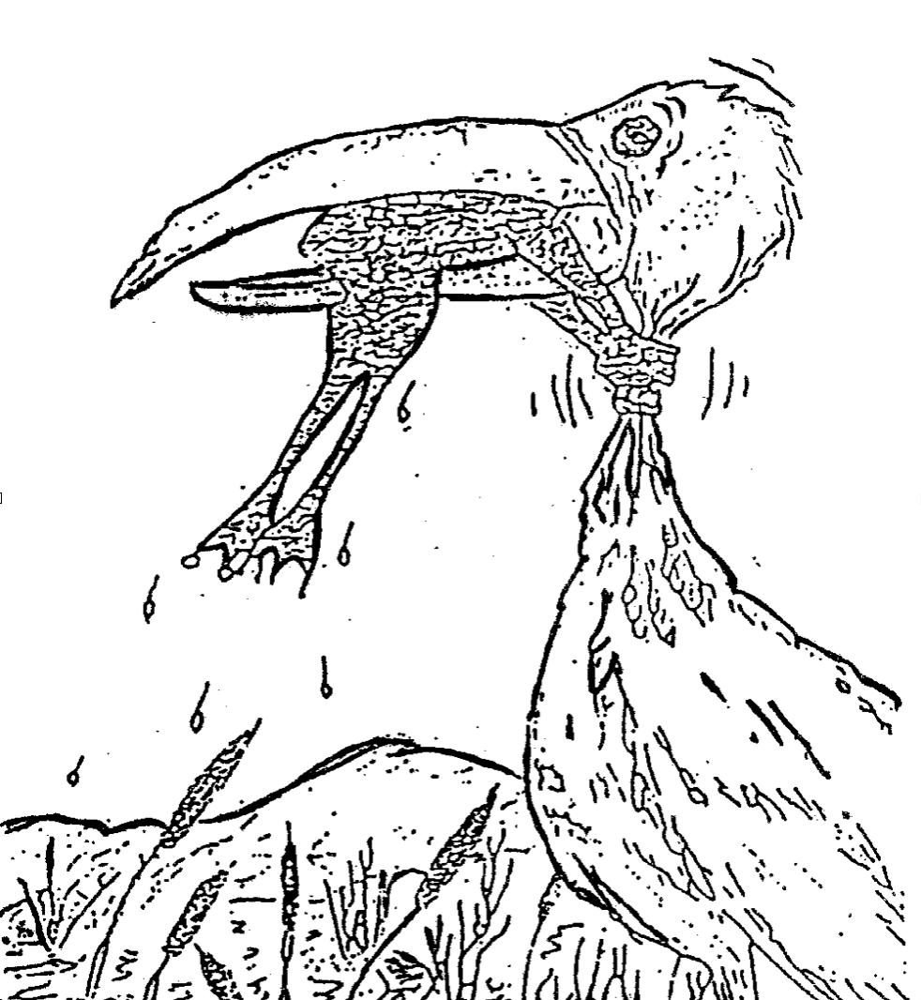
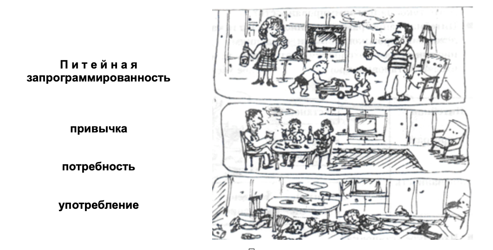
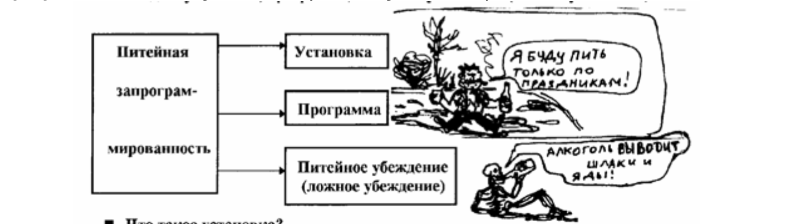
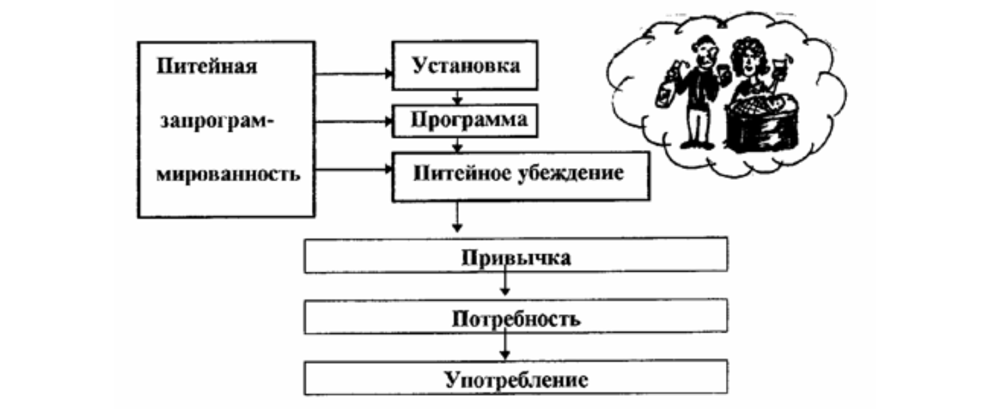
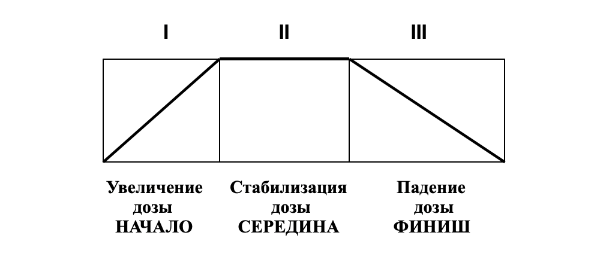
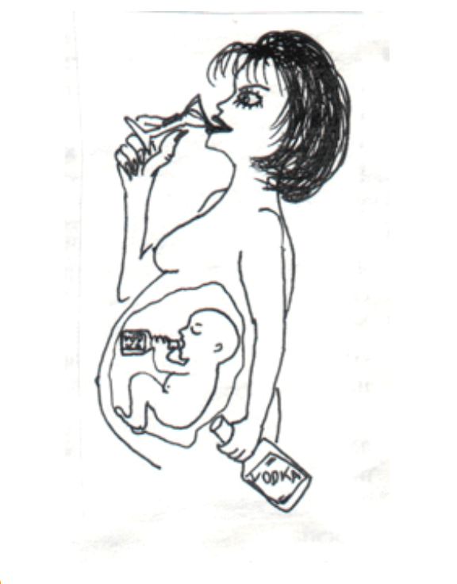
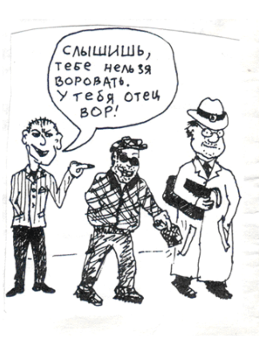

> [Геннадий Шичко](https://ru.wikipedia.org/wiki/Шичко,_Геннадий_Андреевич) о своем методе

# Как стать сознательным трезвенником

* Благотворительный фонд имени Г. А. Шичко – общественная организация, фонд не занимается  политикой, не поддерживает и не выступает против какой-либо политической партии
* Фонд помогает наркоманам и их семьям  независимо от цвета кожи, национальности, вероисповедания, финансового положения
* Фонд не является религиозной организацией, не связан с какой-либо религией, верой или сектой
* Членство в Фонде бесплатное, Фонд существует благодаря добровольным  пожертвованиям только членов фонда, мы независимы, благодаря нашим добровольным взносам

> Все права программы принадлежат Благотворительному Фонду имени Геннадия Андреевича Шичко Программу нельзя использовать с коммерческой целью для получения прибыли Никакая часть этой программы не может быть скопирована в какой-либо форме без письменного разрешения фонда

> © Благотворительный фонд им. Г. А. Шичко, 1995 Все права сохраняются за их владельцем

Адрес фонда : [РОССИЯ, 620014, г. Екатеринбург, ул. Хохрякова, № 33-3.](https://yandex.ru/maps/-/CDBfIJ7i) 
Тел/факс. [+7 (343) 267-17-17](tel:73432671717), [+7 (343) 243-91-81](tel:73432439181) 
E-mail: [trezvayarussia2016@mail.ru](mailto:trezvayarussia2016@mail.ru) 
Сайт: www.trezvayarussia.ru 
Группы VK: [@trezvayarussia96](https://vk.com/trezvayarussia96) [@trezvayarussiareports](https://vk.com/trezvayarussiareports)

### Никогда не сдавайся!

### Наркомания победима!

# Как стать сознательным трезвенником

> Светлой памяти Геннадия Шичко посвящается…

Загадочный метод Шичко – одним он приносит счастье, радость и долгую трезвость, другим – разочарование и снова уход в омут пьянства и наркомании. В чем здесь дело? Почему это происходит? Давайте спросим об этом основателя метода

`🅱` Геннадий Андреевич, в чем состоит ваш метод избавления от алкоголизма и наркомании?

`🅾` Для того, чтобы ответить на этот вопрос, надо дать определение – что такое алкоголизм и наркомания и кого можно назвать наркоманом и алкоголиком. `Алкоголизм` – психологическое страдание, основными признаками которого являются питейная запрограммированность, привычка к употреблению спиртного, потребность в нем и поглощение его

Алкоголик – питейнозапрограммированный человек, обладающий привычкой к употреблению спиртного, потребностью в нем и пьющий. `Цель метода` – избавить человека от первых трех признаков, тогда четвертый исчезнет сам по себе

`🅱` А разве не достаточно избавить человека только от потребности?

`🅾` Нет, не достаточно. Для серьезной и эффективной работы надо учитывать все четыре признака

`🅱` А что такое наркомания?

`🅾` Алкоголизм, курение, наркомания – родственные занятия, они являются наркоманиями. Поэтому то, о чем мы с тобой сейчас говорим, может быть, по аналогии перенесено на курение и наркоманию. В виду схожести понятий, я применяю термин «фармаконаркоман», в связи с тем, что понятие «наркоман» имеет большой объем и включает в себя не только морфинистов, героинистов и им подобных, но и алкоголиков и курильщиков. Привожу иллюстрацию переноса определения. `Фармаконаркоман` – пронаркотически запрограммированный человек, обладающий привычкой к употреблению фармаконаркотиков, потребностью в них и прибегающий к ним

`🅱` Вы сказали, что алкоголизм – это психологическое страдание, а разве это не психическая болезнь?

`🅾` Его располагают на границе психологии и психиатрии, поэтому рассматривают и как болезнь, и как психологическую зависимость. Наиболее же точное определение – страдание. Алкоголики и наркоманы – это страдающие люди. Психические же болезни – такие как белая горячка, алкогольное слабоумие, алкогольные психозы, алкогольный бред ревности и т. д. – имеют право лечить лишь врачи. К ним и только к ним в таких случаях надо обращаться за помощью. Доморошенные «целители», ничего кроме вреда тут не принесут

`🅱` А что такое запрограммированность?

`🅾` `Питейная запрограммированность` – это искаженность сознания человека <u>ложными</u> проалкогольными сведениями, вынуждающая его <u>вопреки инстинкту самосохранения</u> употреблять те или другие наркотики. В нее входят: *установка*, *программа*, *питейное убеждение* (*ложное убеждение*)

`🅱` Что такое установка?

`🅾` `Установка` – это решение употреблять спиртное (курить сигареты), принятое обычно неосознанно в детстве под влиянием окружающей среды

`Программа` – это процедура употребления спиртного (`что пить?`, `когда?`, `с кем?`, `сколько?`)

Программа может меняться в течение жизни. Например, человек принимает решение пить только по праздникам, потом при встрече друзей, а потом по поводу и без повода и начинает пить с пива и шампанского, а заканчивает клеем и одеколоном

`Питейное (ложное) убеждение` – твердая уверенность человека в том, что прием спиртного представляет собой естественное, полезное и даже неизбежное в жизни занятие

Под влиянием всего вышесказанного, а особенно, под действием ложных убеждений, человек начинает употреблять спиртное (сигареты, наркотики) и у него появляется привычка

`🅱` Что такое привычка?

`🅾` `Привычка` – это устойчивые действия в питейных ситуациях (например, выпивать по случаю определенных событий: праздники, встреча друга и т. д.). Воздержание от удовлетворения привычки вызывает чувство психологического дискомфорта. Далее привычка переходит в потребность

`🅱` А чем привычка отличается от потребности?

`🅾` `Потребность` – очень сильная, иногда непреодолимая тяга к спиртному (наркотикам), появляющаяся после приема первых порций алкоголя. Воздержание от удовлетворения потребности вызывает физические страдания. Давай вместе с тобой нарисуем схему того, о чем мы сейчас говорили

### Схема запрограммированности

Итак, мы нарисовали схему входа человека на скамью алкоголика

`🅱` Понятно, но как алкоголик может избавиться от потребности?

`🅾` Смотри, потребность вспыхивает после употребления первых порций алкоголя. Получается по поговорке: «Аппетит приходит во время еды». Кстати, вспышка алкогольной жажды после первых рюмок наблюдается у всех алкоголиков, здесь нет ничего удивительного. Это общая физиологическая закономерность. Мы по собственному опыту знаем, что легче переносить голод и жажду, чем в начальный период их удовлетворения остановиться. И если не будет этой первой рюмки, первых ста грамм, **<u>то не будет и потребности</u>**

`🅱` Если достаточно только прекратить употреблять спиртное, чтобы исчезла потребность, то почему этим не пользуются алкоголики?

`🅾` **Вся беда в том, что они не признают себя алкоголиками и стараются научиться «пить как все»**

`🅱` Почему?

`🅾` Потому что убеждены, что это полезно для здоровья. К сказанному выше о потребности нужно добавить следующее. Она легко и быстро угасает под влиянием разных психологических воздействий. Почти все алкоголики в этом убеждаются на собственном опыте. Иногда бывает достаточно прочесть серьезный противоалкогольный материал, чтобы влечение к спиртному пропало. Один факт, `15 декабря 1974 года` алкоголик `А. К.` решил прекратить свое ужасное существование, поскольку, как он думал, оказался в безвыходном положении: признан безнадежным алкоголиком (лечился и пил, после окончания курса пьянство усилилось), нависла угроза потери работы, семьи и жилища. Решил для храбрости выпить пива и… Сдал бутылки. В пивной ларек огромная очередь. Чтобы отвлечься от горьких дум, развернул случайно оказавшуюся в руках газету «Смена», увидел большую статью `«Двуликий Бахус»`, в которой сообщалось о наших противоалкогольных организациях – [Клубе благоразумия](vk.com/blagorazumno) и `Противоалкогольной секции штаба ДНД Петроградского района`. Прочел раз, второй… Подошла очередь, но желание пить и умереть пропало. На удивление всем пива не взял, ушел… Стал почти трезвенником. Даже на Новый год спиртного не коснулся. `6 января` впервые пришел в нашу `Противоалкогольную секцию` и в течение полутора месяцев был на правах вольнослушателя, никто им не интересовался. За все это время ни разу у него не появилось желание выпить. Под нашим влиянием из стихийного трезвенника превратился в убежденного. За неполные 4 года достиг многого: стал отличным производственником, крупным общественником, настоящим главой семьи, удостоен трудовых медалей, приобрел собственный автомобиль… Примечательно, что лечение `А. К.` не помогло, спасла от алкоголизма газетная статья. Прошу моих читателей, безуспешно лечившихся от алкоголизма не отчаиваться, продолжать борьбу за себя: немного целеустремленности, и жуткая пьяная жизнь уйдет в прошлое

> 💡 *Примечательно, что `А. К.` спасла от самоубийства  и алкоголизма газетная статья*

`🅱` Значит необходимо признать себя алкоголиком? И как определить: <u>я алкоголик или нет</u>?

`🅾` Признать себя алкоголиком – значит посмотреть правде в глаза. Определить ты это можешь, как мы уже говорили, по потребности: если после первых рюмок вспыхивает алкогольная жажда – значит налицо потребность. А наличие потребности признак алкоголизма. К тому же я привожу три стадии, познакомившись с которыми пьющий может сам поставить себе диагноз

### Стадии алкоголизма

1. **<u>Стадия 1</u>**: потребность `слабо` выражена, но по мере продолжения употребления алкоголя усиливается, алкоголик способен ее преодолеть и самостоятельно, стать `воздержанником`; переносимость алкоголя (`толерантность`) непрерывно поднимается и превосходит первоначальную дозу раза в три; отсутствует рвотная защитная реакция; утрачивается способность произвольного прерывания выпивки; похмельный синдром слабо выражен и не всегда появляется; отмечаются отрывочные воспоминания о событиях периода опьянения; пьянство носит `относительно систематический` характер
2. **<u>Стадия 2</u>**: потребность `настолько значительна`, что алкоголик неспособен справиться с нею; переносимость алкоголя достигает наибольшей дозы и далее многие годы держится примерно на этом уровне, затем намечается ее падение; рвотный рефлекс отсутствует; к утрате количественного контроля присоединяется утрата ситуационного; становится сильно выраженным похмельный синдром; провалы в памяти становятся все больше и больше; пьянство `систематическое` и `запойное`; изредка появляются психозы и припадки эпилепсии
3. **<u>Стадия 3</u>**: потребность в спиртном `ярко выражена`, она вспыхивает и становится непреодолимой после приема рюмки спиртного; переносимость алкоголя значительно снижается; восстанавливается рвотный рефлекс; полностью утрачивается количественный и ситуационный самоконтроль; похмельный синдром ярко выражен; забывание событий периода опьянения бывает постоянное, полное и происходит даже после приема небольших доз алкоголя; пьянство `систематическое` и `запойное`; часто появляются психозы и выраженные припадки эпилепсии; быстро протекают: деградация личности, резкое снижение профессиональных навыков и трудоспособности, `утрата связей с родственниками` и трудовым коллективом

Графически стадии можно изобразить так:

`🅱` Можно немножко поподробней, чем характерна первая стадия, и чем она отличается от второй?

`🅾` В первой стадии идет увеличение дозы, например, если раньше организм переносил `300 г`, то сейчас `900 г` и т. д. Во второй стадии достигнут физиологический предел дозы и далее (эта доза) держится долгие годы примерно на одном уровне и как только начинается ее снижение, <u>это говорит о начале третьей стадии</u>. На третьей стадии организм начинает снижать дозу и вначале алкоголик успокаивается, ему кажется, что самое страшное позади, он даже хвастается, что стал пить меньше. В конце концов организм, чувствуя что его убивают, начинает выбрасывать алкоголь – восстанавливается рвотный рефлекс, который был в самом начале (`вспомни`, как рвет пьющих при первых пьянках). В конце концов после очередной пьянки наступает смерть – `бессмысленная жизнь` и `бессмысленная смерть`. Стоило ли ради всего этого жить?

`🅱` Хорошо, я признал себя алкоголиком, перестал пить спиртное, у меня исчезла потребность. А как от привычки освободиться?

`🅾` Ты правильно понял, что с прекращением употребления исчезает потребность, кстати, некоторые алкоголики, сами того не зная, пользуются этим и кому-то удается сохранять трезвость многие годы, отдельным – всю жизнь, их обычно называют людьми с «железной волей». Что же касается `привычки`, то она `сама собой угасает` в случае отказа от выпивок. Ее можно подавить грамотной лекцией, умелой беседой, специальными занятиями на курсе по избавлению от алкоголизма. **Привычка – это условный рефлекс, а условный рефлекс разрушается**

`🅱` Остается запрограммированность?

`🅾` Да, особенно ее последнее звено – `питейное (ложное) убеждение`. Она сама по себе не пропадает, ее не вытравить ни лекарствами, ни физиотерапией, ни иглоукалыванием, ни даже гипнотическими внушениями отвращения к спиртному. `Выросшая на проалкогольной лжи`, она рассеивается `только под влиянием знаний`, `правды`. Я многие годы избавляю людей от алкоголизма и курения только с помощью научных знаний, без каких-либо гипнотических, экстрасенсорных и прочих воздействий. Сведения, которые я довожу до людей, содержат правду и только правду, именно это и делает их эффективным средством отрезвления людей. Хочу подчеркнуть – в информации, которую я передаю слушателям, нет никакой нелегальщины, она состоит из официальных материалов, ни один из которых не был осужден

`🅱` Значит самое главное звено в запрограммированности – `питейное (ложное) убеждение`?

`🅾` Безусловно, **это твердыня и фундамент пьянства и алкоголизма**

`🅱` А чем отличается пьяница от алкоголика?

`🅾` Посмотри снова на схему запрограммированности. У пьяницы в отличие от алкоголика нет потребности. Пьяница – питейнозапрограммированный человек, обладающий привычкой к употреблению спиртного и регулярно пьющий

`🅱` А почему одни люди становятся алкоголиками, а другие нет?

`🅾` Все люди рождаются естественными трезвенниками и остаются ими до тех пор, пока не познакомятся со спиртными напитками, или пока в их сознание не проникнет первая проалкогольная ложь. У каждого человека есть природная защита от алкоголя, у кого-то больше у кого-то меньше

> 💡 *Все люди рождаются естественными трезвенниками*

`🅱` У каких людей ее меньше?

`🅾` У матебремников (мать + бремя). `Матебремники` – люди, на которых их матери в период беременности возложили бремя собственного пьянства, у них, до появления на свет сформировался `«зародышевый алкогольный синдром»`, проще говоря, потребность в спиртном. Поскольку грудным детям алкогольные изделия не дают, она угасает, но в дальнейшем, когда несчастный станет случайником, воскреснет, и он превратится в матебремника, а с переходом к регулярным попойкам – в алкоголика. Данная группа очень быстро спивается, иногда для обретения алкоголизма им хватает несколько выпивок

`🅱` Значит, эти люди обречены быть алкоголиками?

`🅾` Биологическая защита у них слабая, но она все равно есть, и если бы им с детства рассказали правду об алкоголе, то они, не начиная употреблять спиртное вообще, так бы и остались естественными трезвенниками

`🅱` Как найти таких людей среди тех, которые обращаются к вам за помощью?

`🅾` Они могут узнать об этом от родителей, но вряд ли какая мать скажет об этом. Данный термин необходимо знать будущим матерям, они должны быть в курсе, чем грозит их пьянство при беременности и после. Ведь распространенно ошибочное мнение, что полезно пить пиво во время кормления грудью, чтобы ребенок крепче спал

`🅱` Вы сказали, что это зародышевый синдром, и виновата мать, а в каком случае будет виноват отец?

`🅾` Когда во время зачатия или он, или жена, или оба вместе будут в состоянии алкогольного опьянения

`🅱` Это называется передача алкоголизма по наследству?

`🅾` Нет, муж с женой могут редко употреблять спиртное, здесь говорится именно об этом моменте

`🅱` А как же алкоголизм передается по наследству?

`🅾` Есть только наследственная предрасположенность, но алкоголизм по наследству передаться не может, так как главное звено алкоголизма – ложные убеждения, а ложные убеждения по наследству не передаются, они формируются в течение жизни

`🅱` Вы знаете, я слышал, что есть такие приборы, которые при рождении могут определить – будет ли этот человек алкоголиком или нет. И если будет, то его предупреждают: «*Тебе пить нельзя, даже чуть-чуть, потому что у тебя отец алкоголик. Вот другим можно, а тебе нельзя*»

`🅾` Это все равно, что сказать сыну, отец у которого вор: «Тебе вообще нельзя воровать, даже чуть-чуть, иначе ты можешь стать таким же, как твой отец. Вот мне можно немножко воровать, так как у меня батя „честный“!»

`🅱` А у них больше шансов стать алкоголиками, если они родились в их семьях?

`🅾` Модели поведения могут передаваться, есть такое понятие, как наследственность и научение, но они не всегда проявляются. К тому же алкоголик с больной печенью может по наследству передать ее и ребенку. Заметь, не алкоголизм, а больную печень

В результате этого, когда человек выпьет, у него из-за плохой работы печени в кровь попадает больше алкоголя, чем у здорового. В крови есть тельца, которые убивают алкоголь – `алькогольдегидрогиназа`, а они (тельца) тоже работают слабо. В итоге один лежит на асфальте, а другому с такой же дозы хоть бы что. Но это еще раз повторяюсь, если матебремник, или ребенок которого «сделали по пьянке» или же рожденный от алкоголиков попадает в пьющую среду. Ж<u>иви он в трезвом обществе, он так бы и остался трезвым</u>

> 💡 *Заметь, не алкоголизм, а больную печень*

`🅱` 

`🅾`

`🅱`

`🅾`

`🅱`

`🅾`

`🅱`

`🅾`

`🅱`

`🅾`

`🅱`

`🅾`

`🅱`

`🅾`

`🅱`

`🅾`

`🅱`

`🅾`

`🅱`

`🅾`

`🅱`

`🅾`

`🅱`

`🅾`

`🅱`

`🅾`

`🅱`

`🅾`

`🅱`

`🅾`

`🅱`

`🅾`

`🅱`

`🅾`

`🅱`

`🅾`

`🅱`

`🅾`

`🅱`

`🅾`

`🅱`

`🅾`

`🅱`

`🅾`

`🅱`

`🅾`

`🅱`

`🅾`

`🅱`

`🅾`

`🅱`

`🅾`

`🅱`

`🅾`

`🅱`

`🅾`

`🅱`

`🅾`

`🅱`

`🅾`

`🅱`

`🅾`

`🅱`

`🅾`

`🅱`

`🅾`

`🅱`

`🅾`

`🅱`

`🅾`

`🅱`

`🅾`

`🅱`

`🅾`

`🅱`

`🅾`

`🅱`

`🅾`

`🅱`

`🅾`

`🅱`

`🅾`

`🅱`

`🅾`

`🅱`

`🅾`

`🅱`

`🅾`

`🅱`

`🅾`

`🅱`

`🅾`

`🅱`

`🅾`

`🅱`

`🅾`

`🅱`

`🅾`

`🅱`

`🅾`

`🅱`

`🅾`

`🅱`

`🅾`

`🅱`

`🅾`

`🅱`

`🅾`

`🅱`

`🅾`

`🅱`

`🅾`

`🅱`

`🅾`

`🅱`

`🅾`

`🅱`

`🅾`