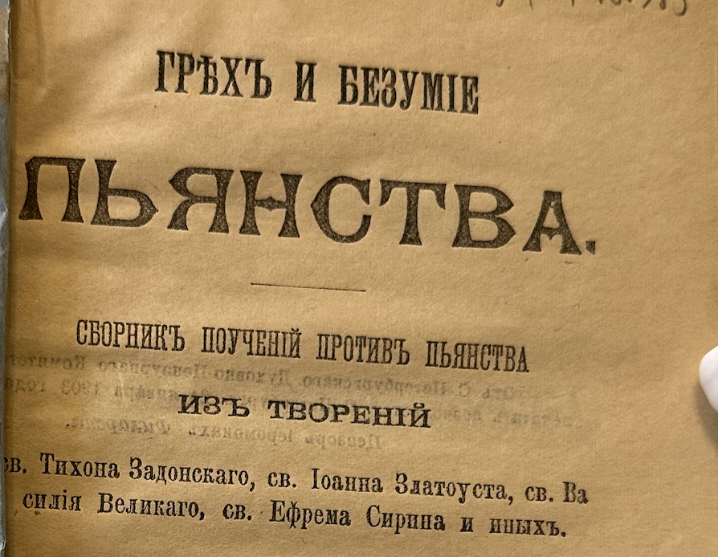

# О пьянстве

> Из поучений св. Тихона Задонского

> Типография И. Д. Сытина • Москва • 1903 • страницы 9—14   РНБ `34.48.6.985`

> От Санкт-Петербургского Духовно-Цензурного Комитета печатать дозволяется. Санкт-Петербург, 24 января 1903 года   Цензор иеромонах *Филарет*

<!-- страница 9. -->

> *У кого вой? У кого стон? У кого ссоры? У кого горе? У кого раны без причины? У кого багровые глаза? У тех, которые долго сидят за вином, которые приходят отыскивать вина приправленного. Впоследствии как змей оно укусит и ужалит как аспид* (`Притч. 23:29—32`)

Скверный и вредительнейший порок есть пьянство, многих зол телесных и душевных виновное. Тело бо понеже естественныя лишает крепости и всяким болезням подвергает; душу ничто так, как пьянство, не погубляет. От пьянства бо ссоры, драки, сквернословия, кличи безчинные, богомерзкие песни, разжения плотские, студные плотоугодия и прочіе безчисленные <!-- страница 10. -->соблазны, явную на душу погибель наводящие, происходят. Почему и Златоуст святый точно научает, что **никто так не бывает дьяволу любим, как в пьянстве пребывающий**. И подлинно так: понеже никто так воли его злой не исполняет, как пьяница. Чего бы трезвый не сделал, на то пьяный дерзает. **Сею страстию обладаемый человек почти в рове погибели лежит, но того не чувствует; погибает, но погибели не познает**, тонет в греховном блате, но освободиться не тщится; как свинья валяется в грязи, но омыться не хочет и на хотящих от той пропасти вывести его негодует. Но слово Божие на порок сей страшно гремит: „Не льстите себе: ни блудницы ни пьяницы“, и прочая, „царствия Божия не наследят“ (`*️⃣ 1 Кор. 6:9-10`). Есть худой обычай у многих – так гостей своих потчевать, что, когда они в домы свои отходят, уже и дороги той не знают, которою в гости шли. К такому угощению как усиленная просьба, так и низкие поклоны в обычай вошли. А злая плотоугодная человеческая хитрость выдумала и вид добрый, которым злоба, как ядъ, медом, прикрывается: за здравие де того и того выпьем, аки бы тому, который поминается, от частого сего поздравления прибавлялось здоровья! Сей обычай и душевредный многие люди не токмо не за грех, но и за учтивость ставят, аки бы и угощение не угощением было, когда гостя допьяна не напоят. Ах, ослепление! Ах, неистовство! Ах, прелесть душегубца-дьявола! Послушайте, слушатели, как <!-- страница 11. -->сии учтивцы в опасном положении сами находятся и тех, которых так бесчеловечно потчуют, в тоежде приводят! – Первое: человек пьяный на всякое зло дерзает, всякие соблазны вводит, как выше сказано. Сих всех беззаконий участник бывает и учтивец тот, так его угостивший, понеже трезвый таких соблазнов не показал бы. Ибо, которая в трезвых, хотя малая, искра разума сияетъ, такая в пьяном совсем угашается. Трезвого хотя и влечет похоть к беззаконию, но совесть вооружается и противостоит – и так отводит от беззакония; а в пьяном похоть уже преодолевает, а совесть ослабевает. – Второе: от сих политичных и ядовитых угощений приходит человек в страсть пьянственную, в которой так затвердевает, что и освободиться от нее не может; и так часто бывает, что он в сем бедственнейшем бесчувствии и живот свой кончает без надежды спасения, которой погибели и мнымый его благодетель оный, или паче злодей, виновник быти судится. **Понеже кто к погибели дорогу отворяет, тот погибели той виновен бывает**. – Третье: сей учтивец и сокращению жития бывает причиною. Ибо от пьянства, к которому он своим учтивством приводит, следуют болезни, а от болезней – смерть. – Четвертое: человек, сим учтивством развращенный, как домашним своим: отцу, матери, жене, детям и друзьям, крайне несносен, так и отечеству ни к чему непотребен является. Вот, слушатели, учтивость сия великих зол виновна бывает! Но от сего порока <!-- страница 12. -->слово Божие предостерегает нас, глаголя: не упивайтеся вином, в нем же есть блуд“ (`*️⃣ Ефес. 5:18`).

-----

Причиною убо пьянства бывает: 1) Злое и невоздержанное сердце, как и прочих грехов. 2) Праздность, как выше сказано. 3) Частые пиршества, компании, усиленные потчевания. 4) Со злыми и невоздержными обращение. От частых же повторений делается страсть и злой обычай.

Пьянство, как само собою есть грех, яко *пияницы царствия Божия не наследят*, по учению апостола `*️⃣ 1 Кор. 6:10`; и Христос глаголет: *внемлите же себе, да не когда отягчают сердца ваша обьядением и пиянством* (`*️⃣ Лук. 21:34`), так многих и тяжких грехов виновно бывает. Оно ссоры, драки и от того последующие кровопролития и убийства производят; оно буесловия, кощунства, хуления, оно ближнему досады и обиды делает. **Оно научает лгать, льстить, чужое грабить и похищать, чтобы было чем страсть довольствовать**; оно возжигает гнев и ярость; оно делает, что люди в нечистоте, как свиньи во блате, валяются; словом сказать, из человека – скотом, из словесного бессловесным делает, так что не токмо внутреннее состояние, но и внешний человеческий вид часто переменяет. <!-- страница 13. -->Откуда святый Златоуст глаголет: „**Дьявол де ничего так не любит, как роскоши и пьянства, понеже никто так злой его воли не исполняет, как пьяница**“ (`Беседы 58 на Матф.`).

Пьянство не токмо душевных, но и телесных временных зол причиною бывает. 1) Тело расслабляет и в немощь приводит. Откуда пишется: *в вине не мужайся, многих бо погуби вино* (`Сирах 31:29`). 2) В убожество и нищету приводит. 3) Славу и имя доброе отъемлет; напротив того, в бесславие, презрение и омерзение приводит: **никем бо так люди не гнушаются, как пьяницей**. 4) Домашним, сродникам, друзьям скорбь и печаль, врагам посмеяние делает. 5) Ни к какому званию неспособным рачителя своего устрояет. И хотя в каком звании будет пьяница, более бед и напастей строит, нежели пользы обществу. Святый Златоуст, изображая бедствия и пагубы пьянства, глаголет: „**Пьянство есть самоизвольное беснованіе**, откровение помышлений, посмеятельная беда, болезнь, смеха достойная, демон добровольный и проч.“ (`Слово о воскресении`).

Чтобы от пьянства остеречься, пользует примечать следующее: 1) **Юным не дозволять пьяного пития пить, понеже юные удобно привыкают, и чего в юности научатся, того и через все житие держаться будут**. 2) Не дозволять им с пьяницами и развращенными водиться. <!-- страница 14. -->3) Взрослым и мужского века достигшим не пить вина. 4) От злых компаний и пиршеств удаляться. 5) Помнить им, что от сей страсти весьма трудно отстать. И многие от той и в той самой страсти погибаютъ душою и телом. 6) Привыкшим к сей страсти крепко против мучительства ее вооружиться, стоять, не поддаваться, молить и призывать всесильную Божию помощь.

-----