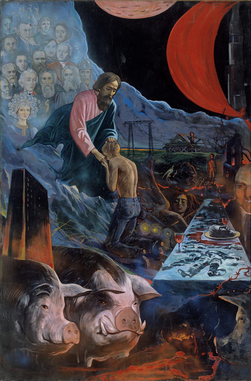

# О коренной причине пьянства [ Александр Захаров, священник ]

> **слово на международном съезде практических деятелей по борьбе за народную трезвость «Россия: трезвый путь»** 20 октября 1995 г.

> АОЗТ «ЭРВИ» • Санкт-Петербург • 2000 • страницы 3—13   ISBN `57353-0020-2`   © Александр Захаров, 2000

<!-- страница 3. --> 

Во имя Отца и Сына и Святаго Духа!

Дорогие братья и сестры,

у садоводов есть обыкновение бороться на своих огородах с сорняками. При этом разные люди действуют по-разному. Опытные садоводы стараются вытаскивать сорняки с корнем. А неопытные или нерадивые просто обрывают зеленые побеги, оставляя корни в земле. И очень скоро сорняки опять появляются на их грядках. Они их опять обрывают – а те снова прут. И пуще прежнего.

Я это к тому что и борьба с пьянством может походить на такую же безплодную борьбу с сорняками – если не выяснить прежде: а что же является главной, *коренной* причиной пьянства? Почему люди пьют?

На этот вопрос мне доводилось слышать разные ответы. Один из наиболее распространенных – он и здесь, на съезде, присутствовал во многих докладах – люди не знают правды об алкоголе, не знают о всех губительных последствиях, которые влечет за собой употребление спиртного. Поэтому и пьют. В этом ответе есть доля правды. И большая. Действительно, узнав всю правду об алкоголе, многие люди ответственнее, серьезней относятся к употреблению спиртных напитков. Некоторые люди отказываются от них вовсе. Но только некоторые, далеко не все. <!-- страница 4. --> Поэтому повторяю, в данном ответе лишь доля правды – но не вся правда.

Тут, может быть, уместно напомнить, что такой взгляд на причину распространения порока – как на отсутствия истинного знания о его вреде – это взгляд еще дохристианский. Его, в частности, придерживался Сократ. Он так именно и считал: люди творят зло и грешат – только потому, что не научены добру. Научи их жить добродетельно – и они перестанут жить порочно. Но христианство утверждает, что грех коренится гораздо глубже в природе человека, чем уровень его интеллекта, знаний. Человек может прекрасно знать, «что такое хорошо и что такое плохо» – более того: может даже очень сильно желать хорошего – а поступать все равно плохо. Замечательны в это отношении слова ап. Павла из его послания к римлянам:

> «*Желание добра есть во мне, но чтобы сделать оное, того не нахожу. Доброго, которого хочу, не делаю, а злое, которого не хочу, делаю… Ибо по внутреннему человеку нахожу удовольствие в законе Божием; но в членах моих вижу иной закон, противоборствующий закону ума моего и делающий меня пленником закона греховного, находящегося в членах моих*» `Рим. 7, 18-19, 22-23`

Если же говорить о пьяницах, так и ту уместно спросить: они что, не знают о том вреде, который причиняет им алкоголь? Не знают, что семья у них бедствует и дома непрестанные скандалы на этой почве? Не знают, что на работе у них неприятности постоянные из-за этого? Не знают, как они расшатали свое здоровье? Знают они обо всем этом лучше нас с вами. Прекрасно все знают и понимают – они же на собственной шкуре каждодневно испытывают все эти губительные последствия употребления алкоголя. Знают, и очень многие, поверьте, сами не рады этой своей <!-- страница 5. --> пьяной жизни. Вида, может быть, не показывают, хорохорятся, но в душе-то тягостно, тошно, погано. А иной уж и не хорохорится, а прямо приходит на исповедь и плачет: «Батюшка, до чего все опостылело…» Вот ведь, какая история: и знает, что пить плохо, и хочет бросить – да не получается. Значит, одних знаний – мало. Коренная причина пьянства – не в отсутствии знаний. В чем же?

Один из выступавших передо мной докладчиков заметил, что употребление алкоголя в нашей стране резко возросло в годы правления Брежнева. В те годы мне доводилось слышать такое объяснение, почему люди пьют. Говорили: загнали нас всех в темный, глухой угол. Невозможно никакое творчество. Людям не дают реализовать себя, самовыразиться. Кругом сплошная ложь, фальшь, лицемерие… Вот люди и пьют. От безысходности. В этом ответе тоже есть доля правды – но опять не все правда. Об этом убедительно свидетельствует сегодняшний день. Ведь мы с вами живем в уникальное время. Не было еще в России таких времен, с такой безбрежной свободой. Возможности для творчества и самовыражения – небывалые. У нас ведь теперь что хочешь, то и твори. Хочешь быть сатанистом – будь сатанистом, хочешь быть гомосексуалистом – будь гомосексуалистом, хочешь быть проституткой – будь проституткой. Как хочешь, так и самовыражайся. Хочешь дело свое открыть – занимайся бизнесом, коммерцией. И что же: получили возможность творчества, свободу самовыражения – и бросили пить? Если бы так. Но мы тут уже слышали статистические данные: пить-то ведь еще больше стали, чем при Брежневе. Значит, и не в этом коренная причина пьянства – не в отсутствии творчества. В чем же? 

В годы засилья марксистско-ленинской идеологии у нас в стране был расхож лозунг, выдвинутый Марксом и под<!-- страница 6. -->хваченный Лениным – лозунг, определяющий религию, как «опиум для народа». Выражение, конечно, грубое и неверное. Однако, автор этого выражения, очевидно, сам не подозревал, как бы он был близок к истине, если б переставил в этом выражении местами слова. Если б сказал не «религия – опиум для народа», а наоборот: «опиум – может являться в известных случаях заменителем, суррогатом, эрзацем религии».

Мы знаем, что есть вещи истинные и есть поддельные. Ярким примером таких подделок является современная мебель, стоящая в наших с вами квартирах. Она на вид кажется деревянною, и даже из дорогого дерева: черного или красного – но это только кажется. На самом деле это просто текстурная бумага, покрытая лаком, а под ней клееные опилки. И наша современная жизнь очень часто бывает похожей на нашу современную мебель…

Так вот, есть вещи истинные и вещи поддельные. У них, однако, имеются какие-то общие свойства. Благодаря им, подделки и находят себе место под солнцем. Иначе они были бы просто никому не нужны. Что же общего, спрошу я теперь, может быть между религией и опиумом?

Сущностью религии является общение с Богом. Этой сущностью опиум, конечно, не обладает. Но вот плодом этого общения с Богом – не единственным, конечно, плодом – но одним из самых сладких плодов – является радость, которую Бог ниспосылает в душу человеческую. Испытавшие эту радость уже никогда и ни с чем ее не перепутают. Она несказанна. И если ее Бог дает – так ее уже никто и никакие обстоятельства отнять не в силах. Люди шли на смерть за Христа – и даже перед лицом смерти – куда страшней ситуация? – но даже перед лицом страшной, часто мучительной смерти люди продолжали *радоваться*.<!-- страница 7. -->

Так вот, радость – это, на мой взгляд, и есть то свойство, благодаря которому опиум находит себе место под солнцем. Ибо и вино, как бы его ни проклинали и не ругали, ~~но надо же сказать и правду, – и вино дает радость~~. А когда бы оно давало одно голое горе – кто бы его и пил? Вам, наверное, известны слова из Библии, слова псалмопевца, которыми любят оправдываться себя пьющие люди, слова о том, что «вино веселит сердце человека». Мне понятно, что очень уж абсолютному трезвеннику это выражение не веселит слух. И я согласен, что когда оно звучит в оправдание пьянства – так это просто кощунство и глумление над Словом Божиим. Но в сути своей это выражение – как и любое выражение из Библии – сущая правда. И я здесь от себя ничего не сочиняю, а только повторяю то, что говорит Священное Писание. А в Нем – как бы этого кому-то не хотелось – но в Нем нет осуждения вина, как такового, и нет проповеди абсолютной трезвости; Слово Божие однозначно осуждает пьянство: «*пьяницы Царства Божия не наследуют*» (`1 Кор. 6:10`). К вину же отношение двоякое. С одной стороны, премудрый Соломон советует: «*не смотри на вино, как оно краснеет, как оно искрится в чаше, как оно ухаживается ровно; впоследствии, как змей оно укусит, и ужалит, как аспид*» (`Пр. 23:31-32`). Но в другом месте тот же премудрый Соломон пишет: «*дайте вино огорченному душею; пусть он выпьет и забудет бедность свою и не вспомнит больше о своем страдании» (`Пр. 31:6-7`). Это – Ветхий Завет, это еще до Христа. После Христа – апостол Павел в послании к римлянам пишет: «*Лучше не пить вина и не делать ничего такого, от чего брат твой претыкается, или соблазняется, или изнемогает*» (`Рим. 14:21`). Но этот же ап. Павел советует ученику своему Тимофею: «*Впредь пей не одну воду, но употребляй не<!-- страница 8. -->много вина, ради желудка твоего и частых твоих недугов*» (`1 Тим. 5:23`). Сам Спаситель наш, Господь Иисус Христос, – если смотреть на Его действия глазами очень уж абсолютного трезвенника, – поступал порою странно. Представьте себе ситуацию: приглашают абсолютного трезвенника на свадьбу. Он заведомо знает, что там будут пить вино. Что он будет делать? Если он очень уж убежденный трезвенник – так он скорее всего и вовсе не пойдет на это мероприятие. Если же по каким-то причинам поддастся на уговоры и пойдет – так что он подумает, если к нему на это свадьбе подойдут с сообщением, что вино кончилось? Наверное подумает: «Ну и слава Богу! Наконец-то они теперь перестанут пить…». Если еж его попросят оказать какое-то содействие в том, чтобы еще добавить вина к столу – так он, думаю, с возмущением откажется. Сочтет, может быть, даже такую просьбу оскорблением для себя. А вот Господь не оскорбился и не возмутился и не отказал в просьбе… Те, что читал Евангелие, очевидно уже поняли, что это я рассказываю о самом первом чуде Спасителя на браке в Кане Галилейской, где Он претворил воду в вино.

Хорошее дело – вода. Даже жизненно необходимое дело – вода. Без воды и жить невозможно. Однако человеку мало – просто жить. Человеку-то, дорогие мои, нужна еще *радость* в жизни. А без радости ему и жизнь будет не в жизнь. И расстаться ему захочется с такой жизнью. Такая безрадостная жизнь кончается рано или поздно петлей или пистолетом у виска, или голова кладется на рельсы… И человек с этой жаждой радости – ищет ее, где может. Если не может найти в религии – находит в вине. Тем более, что человек ведь, дорогие мои, – это такое существо, которое чаще всего идет по пути наименьшего сопротивления: как проще. А ощутить радость от вина – куда <!-- страница 9. -->проще? Не требуются для этого ни духовные подвиги, ни аскетизм, которых требует религия… Цена на спиртное теперь очень низка. Совсем легкий и дешевый источник радости получается. Да, радость эта мимолетна, скоропреходяща, искусственная, поддельная… Но лучше такая радость – чем никакой. Всякий здравомыслящий человек согласится, что лучше иметь мебель из черного дерева, чем из клееных опилок, но если нет стола из черного дерева, так приходится обедать и на столе из ДСП – и это все же лучше, чем обедать вовсе без стола.

Правда, эта радость винная оборачивается потом такими муками и скорбями, которых и не видывали многие аскеты, подвижники благочестия. Эта дешевая радость обходится часто человеку слишком дорого. Но это уже общее правило в науке о радости и скорби, из которого нет исключений. Святые говорят, что радость и скорбь сопутствуют и добродетели и греху. Но добродетельный человек – сначала скорбит, когда ведет духовную брать с искушающим его грехом – а потом радуется, когда превозмогает, с помощью Божией, этот грех. Грешник же наоборот: сначала радуется, когда предается любимому им греху – а потом скорбит. А если не покается – так и вечно уже будет скорбеть в аду. Но люди-то ведь сегодняшние, вместо того, чтобы читать и слушаться святых, слушают всякую дребедень из телевизора. Вот и попадаются в погоне за этой дешевой радостью на крючок дьяволу. А потом уже и рады бы с этим крючком расстаться – да не так-то просто… Однако, я отвлекся и увлекся.

~~Итак, я хотел сказать, что опиум, как и религия, способен приносить человеку радость, облегчение, утешение, ободрение в серой и непростой нашей жизни~~. В этом, я думаю, и заключается главная, коренная причина того, почему люди <!-- страница 10. -->так тянутся ко всем этим одурманивающим веществам: табаку, алкоголю, наркотикам. И будут тянуться до тех пор, пока не будет устранена эта коренная причина, пока они не научатся отличать ценности истинные от подделок – пока радость истинная не засияет в их душе. Вот только тогда и только такой человек уже никогда, конечно, не променяет ее на радость поддельную. Если же не будет в душе радости истинной, человек непременно будет искать хоть какую-то радость. Ибо совсем без радости, повторяю, жить человек не может. Но это еще не все, что я хотел сказать.

Еще я хотел сказать, что человеку и радости в жизни – тоже мало, если это только земная радость, – получаемая от здешних земных удовольствий, увеселений.

В те годы, когда у нас в стране все газеты дружно ругали капитализм и восхваляли социализм в одной из таких наших газет мне попалась на глаза коротенькая заметочка под рубрикой, кажется, «Их нравы». В ней сообщалось о самоубийстве сына какого-то их миллионера. Перед смертью он написал записку такого содержания: «Взял от жизни все. Ничего интересного в ней не нашел. Ухожу из жизни добровольно». Дальше, понятное дело, следовали страстные обличения из бездуховности и т. д. и т. п. Но меня поразила записка. Она меня уже тогда заставила о многом задуматься. В самом деле: чего не хватало этому молодому человеку? Каких удовольствий? Каких радостей? Он мог себе позволить в жизни все. И вот, испытав все, он пришел к такому страшному финалу. Выходит – и просто радости, здешней, земной – тоже недостаточно для человека. Чего же еще-то ему надо?..

Бога надо!

Блаженный Августин писал, что Бог создал нас для себя, и человек нигде не найдет покоя, пока не придет к Нему и<!-- страница 11. -->не соединится с Ним. Поэтому мне сегодня хочется рассказать не только о первом чуде Спасителя – когда он претворил воду в вино, – но и о последнем Его чуде – когда Он уже вино претворил в Кровь Свою… Было время, когда Он чудесным образом накормил пять тысяч человек пятью хлебами, дал людям хлеб. Было время, когда Он чудесным образом претворил воду в вино… И вот теперь, расставаясь с учениками, Он претворяет хлеб и вино в Плоть и Кровь Свою. Для чего? Для того, чтобы не расставаться с ними. И с нами. Никогда. Для того, чтобы вкушая Его Пречистую Плоть и Честную Кровь, мы могли самым теснейшим образом соединиться с Богом, чтобы Его Плоть и Кровь – стали и нашей плотью и кровью. Святой Афанасий Великий говорит: «Христос вочеловечился для того, чтобы мы обожились». То есть Бог сделался человеком для того, чтобы мы могли сделаться более, чем человеками: святыми Божьими человеками, в коих обитает Дух Святой. Богочеловек посетил человечество, чтобы соделать его богочеловечеством. Св. апостол Петр пишет об этом во втором своем послании: «*От Божественной силы Его даровано нам все потребное для жизни и благочестия через познание Призвавшего нас славою и благостию, которыми дарованы нам великие и драгоценные обетования, дабы вы через них соделались причастниками Божеского естества, удалившись от господствующего в мире растления похотью*» (`2 Петр., 1:3-4`). «*Соделаться причастниками Божеского естества*», т. е. стать причастными к естеству Божию – это и значит: «обожиться»… Что-то я, однако, сбился уже на догматическое богословие. Боюсь, такой «догматический хлеб» будет для вас черствоват. Давайте тогда про обычные опять хлеб и воду.

Да, нужны для человека и хлеб и вода – средства, необходимые для жизни. Но нужна человеку и радость – <!-- страница 12. -->расцвечивающая жизнь. А всего нужнее для человека Богообщение – освящающее, «обоживающее» жизнь. Все эти три составные нужны. Без любой из них немыслима полноценная человеческая жизнь. И все эти три составные дает нам милосердный Господь и Церковь Его святая.

Вдумайтесь: что происходит во время праздничного богослужения на вечерне, на литии, когда освящаются хлеб, вино и елей? А потом, на утрене священник помазывает этим елеем чело молящимся и раздается им этот хлеб, окропленный вином?.. Тоже ведь, наверно, непонятные и странные действия, с позиций очень уж абсолютного трезвенника? Зачем освящать вино?.. А здесь есть свой смысл и глубокая символика. Здесь ведь, под видом хлеба, вина и елея – и подаются человеку эти три составные, необходимые для полноценной его жизни. Хлеб – символ средств, необходимых для жизни, вино – символ радости, елей – символ святости. В древности елеем помазывали только царей, пророков, т. е. особо избранных Богом людей. Теперь помазывают всех чад Церкви – как «*царственное священство*», по слову апостола (`1 Пет., 2:9`).

И я совестью пастырской свидетельствую, что человек, имеющий в жизни эти три составные, в особенности последнюю: Богообщение – человек, живущий полнокровной церковной жизнью – участвующий в богослужении, в Таинствах церковных, регулярно исповедующийся и причащающийся, – такой человек не знаком с проблемой алкоголизма, она для него просто не существует. Поэтому-то, видимо, и не ставится так остро этот вопрос о борьбе с пьянством в церковной среде и у святых отцов. Не было среди святых отцов пьяниц. Многие другие пороки их искушали и с ними они вели борьбу и писали о них – но только не этот, не пьянство. Вино для них никогда не ста<!-- страница 13. -->новилось причиной алкоголизма. Поэтому и относились они к нему достаточно спокойно. Хотя пьянство в народе, конечно же, их волновало и против него они поднимали свой голос, памятуя эти слова Священного Писания, о которых я уже сегодня вспоминал, что «*пьяницы Царства Божия не наследуют*».

В заключение скажу так. Если мы хотим всерьез искоренить из жизни пьянство – надо взамен пьяной жизни возрождать, устроять жизнь церковную. Без этого все наши усилия по борьбе с пьянством будут походить на ту борьбу с сорняками, о которой я говорил вначале. Больше того скажу: если отрезвлять людей без Церкви, не проводя их к Богу – для них такое отрезвление может пойти даже не на пользу, а во вред. В Евангелии говорится, что когда дух нечистый выходит их человека, то он не находит себе покоя. И снова возвращается туда, откуда вышел. И вот, если находит место незанятым, то берет с собою семь других духов, злейших себя, и они вселяются в этого человека все вместе. «*И бывает, для человека того последнее хуже первого*» (`Мф. 12:45`). Когда уходит из жизни ~~радость винная~~ и не занимает ее место радость небесная – такой человек часто начинает искать радостей в еще горших грехах, чем пьянство: в разврате, в азартных играх… А если не находит нигде радости, так становится злым и угрюмым. И жизнь с таким человеком становится для домашних его сущим адом. Она даже иногда говорят: «Лучше бы уж пил…»

Заканчиваю. Простите, что занял так много Вашего времени. Спаси Вас, Господи, за то, что послушали меня, грешного.

Аминь.