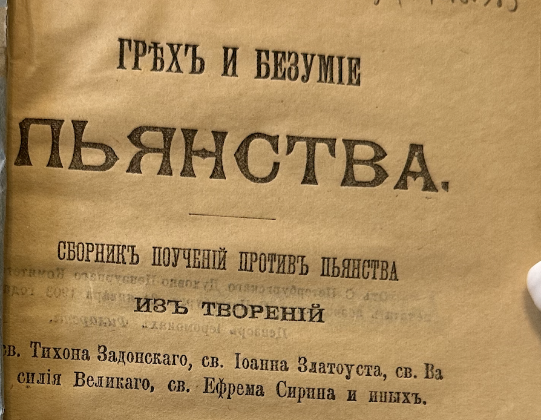
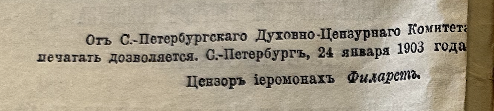

# Пора опомниться!

> Типография И. Д. Сытина • Москва • 1903 • страницы 23—26   РНБ `34.48.6.985`

> От Санкт-Петербургского Духовно-Цензурного Комитета печатать дозволяется. Санкт-Петербург, 24 января 1903 года   Цензор иеромонах *Филарет*

<!-- страница 23. -->

Вино губит телесное здоровье людей, губит умственные способности, губит благосостояние семей и, что всего ужаснее, губит душу людей и их потомство, и, несмотря на это, с каждым годом все больше и больше распространяется **употребление спиртных напитков и происходящее от него пьянство**. Заразная болезнь захватывает все больше и больше людей: пьют уже женщины, девушки, дети. И взрослые не только не мешают этому отравлению, но, сами пьяные, поощряют их. И богатым, и бедным представляется, что веселым нельзя иначе быть как пьяным или полупьяным; представляется, что при всяком важном случае жизни: похоронах, свадьбе, крестинах, разлуке, свидании, самое лучшее средство показать свое горе или радость состоит лишь в том, чтобы одурманиться и, лишив<!-- страница 24. -->шись человеческого образа, уподобиться животному.

И что удивительнее всего, это то, что люди гибнут от пьянства и губят других, сами не зная, зачем они это делают. В самом деле, если каждый спросит себя, для чего люди пьют, он никак не найдет никакого ответа. <u>Сказать, что вино вкусно, нельзя</u>, потому что каждый знает, что вино и пиво, если они не подслащены, кажутся неприятными для тех, кто их пьет в первый раз. **К вину приучаются, как к другому яду – табаку, понемногу**, и нравится вино только после того, как человек привыкнет к тому опьянению, которое оно производит. <u>Сказать, что вино полезно для здоровья, тоже никак нельзя</u> теперь, когда многие доктора, занимаясь этим делом, признали, что ни водка, ни вино, ни пиво не могут быть здоровы, потому что питательности в них нет, а есть только яд, который вреден. С<u>казать, что вино прибавляет силы, тоже нельзя</u>, потому что не раз и не два, а сотни раз было замечено, что артель пьющая в столько же людей, как и артель непьющая, сработает много меньше. И на сотнях и тысячах людей можно заметить, что люди, пьющие одну воду, сильнее и здоровее тех, которые пьют вино. <u>Говорят тоже, что вино греет, но и это неправда</u>, и всякий знает, что выпивший человек, согревается только накоротко, а надолго скорее застынет, чем непьющий. <u>Сказать, что если выпить</u> на похоронах, на крестинах, на свадьбах, при свиданиях, при разлуках, при покупке, продаже, <u>то лучше <!-- страница 25. --> обдумаешь то дело</u>, для которого собрались, – <u>тоже никак нельзя</u>, потому что при всех таких случаях нужно не одуреть от вина, а с свежей головой обсудить дело. **Что важней случай, то трезвей, а не пьяней, надо быть**. <u>Нельзя сказать и того, чтобы вредно было бросить вино тому, кто привык к нему</u>, потому что мы каждый день видим, как пьющие люди попадают в острог и живут там без вина и только здоровеют. <u>Нельзя сказать и того, чтобы от вина больше веселья было</u>. Правда, что от вина накоротко люди как будто и согреваются и развеселяются, но и то и другое не надолго. **И как согреется человек от вина и еще пуще озябнет, так и развеселится от вина человек и еще пуще делается скучен**. Только стоит зайти в трактир да посидеть, посмотреть на драку, крик, слезы, чтобы понять то, что **не веселит вино человека**. <u>Нельзя сказать и того, чтобы не вредно было пьянство</u>. Про вред его телу и душе всякий знает.

И что же? И не вкусно вино, и не питает, и не крепит, и не греет, и не помогает в делах, и вредно телу и душе – и все-таки столько людей его пьют, и что дальше, то больше. Зачем же пьют и губят себя и других людей? „Все пьют и угощают, нельзя же и мне не пить и не угощать“, отвечают на это многие, и, живя среди пьяных, эти люди точно воображают, что все кругом пьют и угощают. Но ведь это неправда. Если человек вор, то он будет и водиться с ворами, и будет ему казаться, что все воры. Но стоит ему бросить воровство, и <!-- страница 26. -->станет он водиться с честными людьми и увидит что не все воры. То же и с пьянством. Не все пьют и угощают. Если бы все пили, так уже не надолго бы оставалось и жизни людям: все бы перемерли; но этого не допустит Бог; и всегда были и теперь есть много и много миллионов людей непьющих и понимающих, что пить или не пить – дело не шуточное. Если сцепились рука с рукой люди пьющие и торгующие вином и наступают на других людей и хотят споить весь мир, то пора и людям разумным понять, что и им надо схватиться рука с рукой и бороться со злом, чтобы их и их детей не споили заблудшие люди.

Пора опомниться!

-----