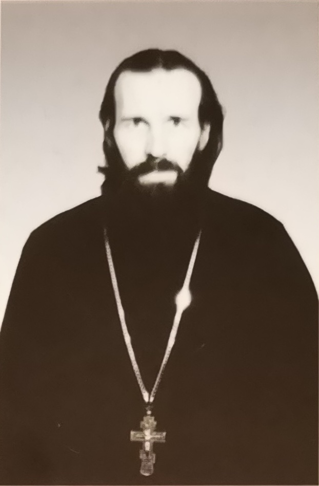

# Релиз trezvost/trezvost

- [ ] «[О коренной причине пьянства](../index_ru/захаров_а:о_коренной_причине_пьянства.md)»
- [ ] «[Слово к пастве после съезда](../index_ru/захаров_а:слово_к_пастве_после_съезда.md)»

> 💾 Цифровая версия брошюры подготовлена командой `trezvost/trezvost` 
> ⚙️ Как и многие священники, А. Захаров проалкогольно запрограммирован (по крайней мере на момент выпуска брошюры) 
> ☦️ К сожалению, рукоположение в священники не меняет ложных убеждений человека касательно алкоголепития 
> 👾 Мы не считаем себя в праве менять тексты оцифрованных изданий, но видим своей обязанностью особо выделить ~~самые опасные и деструктивные утверждения любого автора~~

-----

слово пастыря • священник Александр Захаров

# Слова о трезвости

> АОЗТ «ЭРВИ» • Санкт-Петербург • 2000  ISBN `57353-0020-2`   © Александр Захаров, 2000

-----

    Автор просит боголюбивых читателей
    помолиться о здравии раба Божия Андрея
    со чадами Алексием и Александрой
    Попечением сего, раба Божия Андрея, издана данная брошюра

-----

    Автор выражает признательность
    Илье Сергеевичу Глазунову
    за дозволение использовать в оформлении данной брошюры
    репродукцию его картины «Возвращение блудного сына» /1977/

-----

По вопросам оптовой покупки данной брошюры обращаться по адресу:

> 198035, Санкт-Петербург, ул. Двинская № 2.

> [*Церковь Богоявления (на Гутуевском острове)*](https://www.citywalls.ru/house3729.html)

> `✆` +7 (812) 251-70-40 

-----

    Лицензия ЛР № 065338 от 07.08.97
    Подписано к печати 17.02.2000. Формат 60 x 84/16.
    Гарнитура Таймс. Печать офсетная. Бумага газетная.
    Печ. л. 2. Усл. печ. л. 1,86. Усл. кр.-отт. 1,86.
    Тираж 10 000 экз. Заказ № 56.

-----

> АОЗТ «ЭРВИ» • 191126, Санкт-Петербург, Звенигородская ул. № 9.

> Санкт-Петербургское ГУП «Пушкинская типография» 189620, Санкт-Петербург, Пушкин, ул. Средняя № 3/8.

-----

## Священник Александр Захаров • Об авторе

> Священник **Александр Захаров** родился в 1956 году в Нарве (Эстония). Вскоре его семья переезжает в Ленинград, и с городом на Неве связывается вся дальнейшая жизнь будущего пастыря. По окончании средней школы он служит в армии, затем в течение тринадцати лет работает на стройках города  В 1990 году Александр Захаров поступил в Ленинградскую Духовную Семинарию. За время учебы, пройдя послушания псаломщика и алтарника в 1991 году приснопамятным Иоанном (Снычевым; 1995), митрополитом Санкт-Петербургским и Ладожским, был рукоположен в сан диакона, а в 1992 – им же – во иерея  Сейчас отец Александр служит **в Богоявленской церкви на Гутуевском острове** в Санкт-Петербурге; православному миру он известен как автор книги `«К кому нам идти? Обращение к верующим и неверующим»` (1996), брошюр `«Слово об обортах»` (1998), `«Слово о счастии»` (1997), ряда статей и выступлений